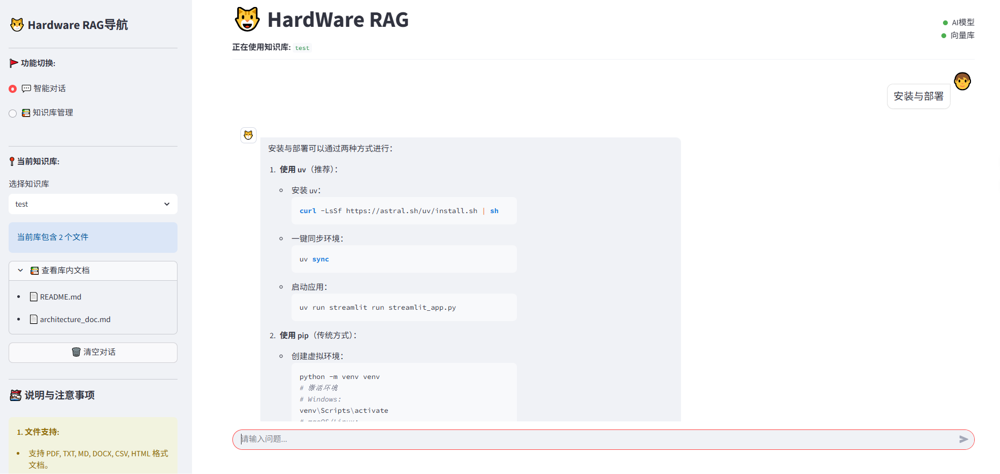
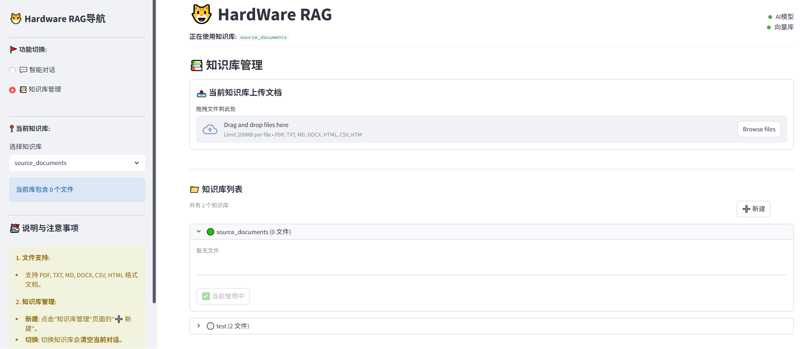

# Hardware DataBase

Hardware DataBase 是一个面向硬件设计资料、项目文档、结构化表格和电路设计（EDF 网表/原理图）的智能数据基座。

## 核心特性

- **Agentic 查询流程**：问题拆解、知识库文件扫描、检索范围规划、多源检索、证据覆盖度判断、必要时自动补检索、最终 grounded answer。
- **多源 pipeline**：普通文档进入 RAGFlow 检索链路；Excel 进入结构化表格索引；EDF 网表进入电路结构化索引；均由 agent 统一调度。
- **RAGFlow 后端固定化**：文档上传、解析任务、检索、删除和知识库治理都通过 RAGFlow 后端适配层完成。
- **权限与治理**：支持部门、用户、知识库权限、审计日志、查询 trace 和文件处理状态。
- **独立模型配置**：Agent 最终答案生成使用项目自有 `LLMClient`，支持 Ollama 或 OpenAI-compatible API，不再复用旧 RAG 框架模型封装。

## 界面示例





## 项目结构

```text
Hardware-DataBase/
├── assets/                     # 应用示例图片
├── config/
│   └── settings.py             # 全局配置与 .env 加载（单一事实来源）
├── data/                       # (自动生成) 原始文档存储
├── docs/                       # 架构与设计文档
│   ├── architecture_doc.md     # 当前整体架构
│   ├── pipeline_contract.md    # pipeline 隔离契约
│   ├── langgraph_agentic_query_design.md
│   ├── joint_retrieval_test_cases.md
│   └── hardware_database_develop_integration_plan.md
├── evaluation/                 # RAGAS 评估数据集与说明
│   ├── datasets/hardware_qa_v1.jsonl
│   └── README.md
├── src/
│   ├── agents/                 # LangGraph 查询编排（graph/runner/state/prompts + tools/）
│   ├── circuit/                # 电路网表/原理图解析与结构化检索
│   ├── core/                   # AppPipeline、鉴权、LLMClient、会话、source group 路由
│   ├── evaluation/             # RAGAS 评估子系统（CLI、service、metrics、gates）
│   ├── ingestion/              # source group 分类、KB 路径、解析任务、容器检查
│   ├── pipelines/              # 多源 pipeline（document_rag/、spreadsheet/、registry、runtime）
│   ├── services/               # 文档治理、路由、归档、KB scope、资产清理
│   ├── test_data/              # 测试数据结构化域（ingest-only）
├── frontend/                     # React + TypeScript 前端（对接 src/api 的 FastAPI 服务）
│   └── ...
├── storage/                    # (自动生成) 归档、索引、日志与鉴权库
├── tests/                      # 单元与集成测试（unittest.TestCase）
├── src/api/                    # FastAPI 后端（唯一后端入口，见 src/api/routes/）
├── pyproject.toml
├── requirements.txt
└── README.md
```

## 环境要求

- **Python**：>= 3.12
- **RAGFlow**：需准备一个可访问的 RAGFlow 实例作为文档检索后端，并获取其 API Key。
- **Ollama**：当 `AGENT_LLM_PROVIDER=ollama`（默认）时需要本地 [Ollama](https://ollama.com/) 服务并拉取对应模型；若改用 OpenAI-compatible API 则无需 Ollama。

## 安装

### 方式一：使用 uv（推荐）

[uv](https://github.com/astral-sh/uv) 是一个极速的 Python 包管理器。

安装 uv（如尚未安装）：

```bash
# macOS / Linux
curl -LsSf https://astral.sh/uv/install.sh | sh
# Windows (PowerShell)
powershell -c "irm https://astral.sh/uv/install.ps1 | iex"
```

同步环境并启动后端 API（`uv run` 会自动加载虚拟环境，无需手动 activate）：

```bash
uv sync
uv run hardware-database-server   # FastAPI 后端，默认 127.0.0.1:8000（HDB_API_HOST/PORT 可改）
```

另开终端启动前端（Node.js >= 18）：

```bash
cd frontend
npm install
npm run dev                       # Vite dev server，默认 127.0.0.1:5174，经 proxy 转发 /api 到后端
```

生产部署用 `npm run build` 产出 `frontend/dist/` 静态文件。

### 方式二：使用 pip

```bash
python -m venv venv
# Windows
venv\Scripts\activate
# macOS / Linux
source venv/bin/activate

pip install -r requirements.txt
uvicorn src.api.app:create_app --factory --host 127.0.0.1 --port 8000
```

## 配置说明

支持两种配置方式：**管理页面配置**（推荐）和 **`.env` 文件配置**。

> 注意：仓库根目录的 `.env` 已提交且包含**真实 API Key**，并残留若干旧架构变量（`RAG_BACKEND`、`PROVIDER`、`CUSTOM_LLM_MODEL`、`BM25_TOP_K`、`RERANKER_TYPE`、`CHUNK_SIZE` 等，`config/settings.py` 已忽略）。请以 `.env.example` 为模板，以下方变量为准。

### 方式一：管理页面配置（推荐）

启动前后端后，用系统管理员登录前端，进入 **「系统配置」** 页面，可直接修改模型、RAGFlow、检索等配置并立即生效，配置会持久化保存到 `.env` 文件。

### 方式二：`.env` 文件配置

在项目根目录创建 `.env`，按需填写（以下为 `config/settings.py` 实际读取的变量及默认值）：

```env
# ==================== RAGFlow 后端 ====================
RAGFLOW_BASE_URL=http://localhost:9380
RAGFLOW_API_KEY=
RAGFLOW_GOVERNANCE_DATASET_NAME=department_governance
RAGFLOW_DESIGN_DATASET_NAME=project_design_assets
RAGFLOW_TIMEOUT_SECONDS=120
RAGFLOW_SIMILARITY_THRESHOLD=0.25
RAGFLOW_VECTOR_WEIGHT=0.4

# ==================== Agent LLM ====================
# provider: ollama | custom
AGENT_LLM_PROVIDER=ollama
AGENT_OLLAMA_BASE_URL=http://localhost:11434
AGENT_OLLAMA_MODEL=qwen2.5:32b
AGENT_TEMPERATURE=0.2
AGENT_TIMEOUT_SECONDS=120

# HTTP 429 重试（仅 custom 提供商生效；重试耗尽后抛出原始错误）
AGENT_RATE_LIMIT_MAX_RETRIES=4
AGENT_RATE_LIMIT_INITIAL_DELAY_SECONDS=1
AGENT_RATE_LIMIT_MAX_DELAY_SECONDS=16

# 或使用 OpenAI-compatible API（provider=custom 时生效）
AGENT_CUSTOM_API_KEY=
AGENT_CUSTOM_BASE_URL=https://api.openai.com/v1
AGENT_CUSTOM_MODEL=
AGENT_CUSTOM_MAX_TOKENS=4096

# ==================== 检索与 Agent 行为 ====================
FINAL_TOP_K=5
AGENT_MAX_RETRIEVAL_ROUNDS=3

# ==================== 鉴权（通常无需修改）====================
AUTH_DB_PATH=storage/auth.db
AUTH_DEFAULT_ADMIN_USERNAME=admin
AUTH_DEFAULT_ADMIN_PASSWORD=
AUTH_SESSION_TTL_HOURS=24

# ==================== 存储路径（通常无需修改）====================
PIPELINE_ARCHIVE_ROOT=storage/pipeline_archives
RAGFLOW_FILE_ROOT=storage/pipeline_archives

# ==================== 提示词（可选）====================
SYSTEM_PROMPT=
NO_CONTEXT_PROMPT=
```

## 查询流程

```text
前端 (React)
  -> FastAPI (/api/v1)
  -> AppPipeline
  -> MultiSourceAgentRunner
  -> LangGraph
  -> Tool adapters
     - RAGFlow document retrieval
     - Spreadsheet semantic/cell search
     - Circuit structured query (netlist)
  -> LLMClient 生成最终答案
```

## 常见问题

**Q: 运行 `uv sync` 时提示 lock file is not up to date？**
A: 通常发生在手动修改了 `pyproject.toml` 之后。运行 `uv lock` 更新锁定文件，再执行 `uv sync`。

**Q: 启动时提示 `ModuleNotFoundError`？**
A: 使用 uv 时必须用 `uv run` 启动命令，或先 `source .venv/bin/activate` 再运行；使用 pip 时请确认已激活虚拟环境并安装依赖。

**Q: 上传文件后在问答中搜不到内容？**
A: 当前检索后端为 RAGFlow，请按顺序排查：1) RAGFlow 服务是否可达、`RAGFLOW_API_KEY` 是否正确；2) `RAGFLOW_GOVERNANCE_DATASET_NAME` / `RAGFLOW_DESIGN_DATASET_NAME` 对应的 dataset 是否存在；3) 在「日志中心」或知识库文件页确认 RAGFlow 解析任务是否完成。

**Q: Agent 响应很慢或超时？**
A: 可适当调大 `AGENT_TIMEOUT_SECONDS`；检查 `AGENT_MAX_RETRIEVAL_ROUNDS` 是否过大导致多轮补检索；确认 LLM 模型（Ollama 或 custom API）的响应速度。

**Q: 首次启动后无法使用问答？**
A: 请先以系统管理员进入「系统配置」检查并补全 RAGFlow 与 Agent 模型配置，保存后生效。

## RAGAS 回答质量评估

项目提供独立的 RAGAS 评估子系统，可在线调用真实问答管线，也可对保存的回答快照离线重评。内置数据集 `evaluation/datasets/hardware_qa_v1.jsonl` 包含 25 条电路、文档、联合检索、多跳、缺失证据、冲突、权限和直答用例。

安装评估依赖并校验数据集：

```powershell
uv sync --group eval
uv run hardware-database-eval validate --dataset evaluation/datasets/hardware_qa_v1.jsonl
```

运行端到端评估或重评已有快照：

```powershell
uv run hardware-database-eval run --dataset evaluation/datasets/hardware_qa_v1.jsonl --output storage/evaluations
uv run hardware-database-eval score --dataset evaluation/datasets/hardware_qa_v1.jsonl --snapshot storage/evaluations/<run_id>/snapshot.jsonl --output storage/evaluations
```

默认只生成 JSON、CSV 和 HTML 报告。需要在 CI 中启用阈值门禁时添加 `--fail-on-threshold`。可用 `--tag`、`--sample-id`、`--metric` 和 `--threshold faithfulness=0.8` 过滤或覆盖评分设置。

裁判 LLM 默认复用 `AGENT_*`。Embedding 必须通过 `EVAL_EMBEDDING_BASE_URL`、`EVAL_EMBEDDING_API_KEY` 和 `EVAL_EMBEDDING_MODEL` 显式配置；完整示例见 `.env.example`。前端「RAGAS 评估」页面仅系统管理员可见。

管理员可在该页面查看运行阶段、当前样本、完成/总数、成功/失败数和已耗时间。“暂停”和“取消”均为协作式操作：它们会等待正在执行的模型请求结束，并在下一个安全检查点生效；“取消”不会删除 `snapshot.jsonl`；“继续”会跳过其中已成功的样本。未勾选“执行 RAGAS 评分”时，系统只采集回答和检索证据，无需安装 `eval` 依赖或配置裁判 Embedding。

- 评估数据集格式与扩展方式：`evaluation/README.md`
- 运行产物：`storage/evaluations/<run_id>/`

- `snapshot.jsonl` 保存回答和检索上下文，可更换裁判模型重复评分。
- `retrieved_contexts` 保存原始检索结果；`results.jsonl` 中 `metadata.ragas_scoring.scored_contexts` 保存实际送入 RAGAS 的上下文窗口。评分任务进度只表示工作项完成情况，不能替代有效评分数和评分失败数。
- 每个运行目录都会保存 `run_state.json`。在线运行在至少持久化一条采集结果后，才会在该目录生成 `snapshot.jsonl`；离线运行则引用所提供的快照路径，该路径可能位于运行目录之外。只有完成评分的运行才会生成 `summary.json`、`results.jsonl`、`summary.csv` 和 `report.html`。
- `summary.json` 是自动化消费的权威汇总，`summary.csv` 用于表格分析，`report.html` 用于人工查看。
- 单题或单指标失败不会终止整批；`not_applicable` 不计入指标均值。

## 说明

- “知识库”现在是业务隔离与权限治理单元，不代表本地向量库。
- 检索后端固定为 RAGFlow，项目内不再维护本地向量索引。
- Excel 等结构化数据不走本地 RAG，而是由 spreadsheet pipeline 建立结构化索引后交给 agent 调度。

## License

MIT License
