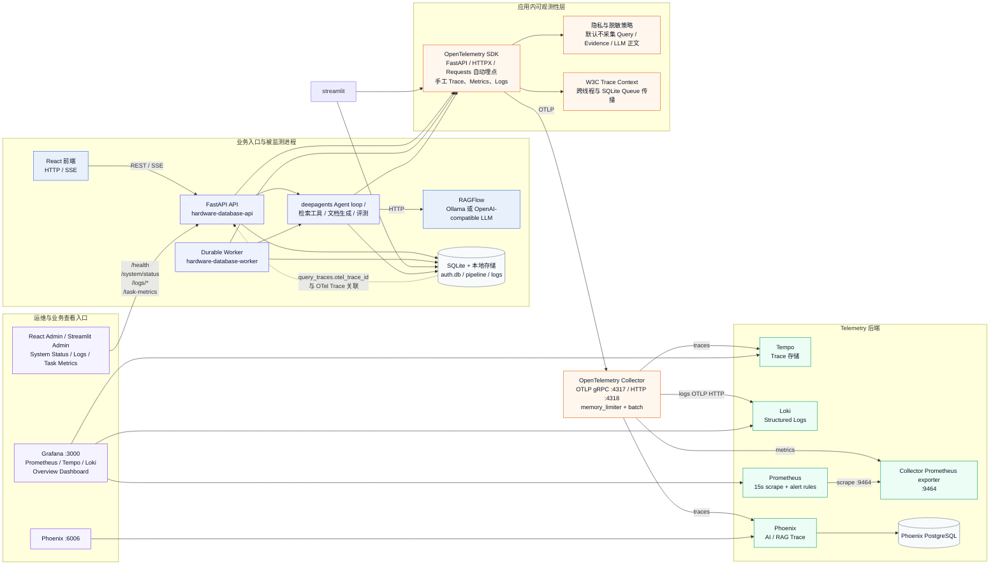

# Hardware-DataBase-observability 当前监测架构

> 依据当前分支代码和 `docker-compose.yml` 绘制；这是“当前已实现/已配置”的架构，不包含方案文档中尚未落地的组件。Docker 容器是否正在运行需要在具备 Docker socket 权限的环境中另行核验。

## 1. 总体架构

图中有两条并行的观测面：

- **技术可观测性面**：应用通过 OTel 将 Trace、Metric、Log 发送给 Collector，再分别进入 Tempo、Prometheus、Loki；Trace 同时复制到 Phoenix。
- **业务事实面**：应用继续把审计事件、Query Trace、检索证据、Worker 心跳和任务状态写入 SQLite；管理页面通过 API 查询，并用 `otel_trace_id` 跳转到 Grafana/Phoenix。

## 2. 三类 telemetry 的实际流向

| 类型 | 应用侧产生 | Collector 路由 | 查看位置 |
| --- | --- | --- | --- |
| Trace | FastAPI 请求、Agent/Chain、LLM、Retriever、Tool、Evaluator、Authoring | Tempo + Phoenix | Grafana、Phoenix |
| Metric | Chat、Agent、Retrieval、LLM、Worker、Queue、Evaluation、Authoring | Prometheus exporter → Prometheus | Grafana、Prometheus 告警规则 |
| Log | `RAG` logger 的结构化 JSON；带 OTel `trace_id/span_id` | Loki；同时保留本地 console/file | Grafana Loki、`storage/logs/` |

### Trace 关联

每次查询的业务记录保留两套 ID：

- `query_traces.id`：业务数据库主键，用于查询证据和权限控制。
- `query_traces.otel_trace_id` / `otel_span_id`：技术 Trace ID，用于打开 Grafana/Phoenix。

OTel Context 会通过线程、线程池和持久化 Queue carrier 传播，因此 API 创建的对话任务和 Worker 执行可以保持同一条 Trace 链路的父子关系。

## 3. 当前告警与面板

Prometheus 当前配置了 6 类告警：聊天错误率、聊天 P95 延迟、队列积压、Worker 失败、检索空结果率、LLM P95 延迟。Grafana Overview 面板当前展示聊天状态/延迟、队列深度和 LLM 延迟。

当前 Compose 配置没有 Alertmanager 或外部通知渠道；告警目前停留在 Prometheus 规则评估层。

## 4. 当前健康检查和权限边界

- `/health`、`/health/live`：存活检查。
- `/health/ready`：SQLite 和本地 Storage 就绪检查。
- `/health/dependencies`：管理员可查看 SQLite、Storage、Worker、RAGFlow 和 LLM 依赖状态。
- `/api/v1/system/status`：管理页面聚合依赖状态和近 24 小时任务统计。
- `/api/v1/logs/*`：按管理员角色和部门范围查询审计、Query Trace、Evidence。
- `/api/v1/task-metrics`：权限控制的业务聚合接口，不是 Prometheus `/metrics` 端点。

Telemetry 导出是 **fail-open** 的：Collector 或监测后端不可用时，业务请求不应因 telemetry 导出失败而中断。敏感正文采集由 `OBS_CAPTURE_*` 开关控制，当前示例配置默认关闭。

评测和文档生成在 API、Streamlit 或 Worker 进程内执行时会复用该 OTel provider；独立 `hardware-database-eval` CLI 当前没有显式调用 `init_observability`，因此默认不会形成完整的外部 telemetry 流。

## 5. 代码与部署对应关系

| 层 | 主要位置 |
| --- | --- |
| OTel 初始化、自动埋点、Exporter | `src/observability/bootstrap.py` |
| Trace/Metric/Log facade | `src/observability/tracing.py`、`metrics.py`、`logging.py` |
| Context 传播与关联 | `src/observability/context.py`、`src/core/app_logs.py` |
| 健康检查、Worker 注册 | `src/observability/health.py`、`worker_registry.py` |
| API / Worker 接入 | `src/api/app.py`、`src/workers/main.py` |
| Collector / 存储 / Grafana | `deploy/observability/` |
