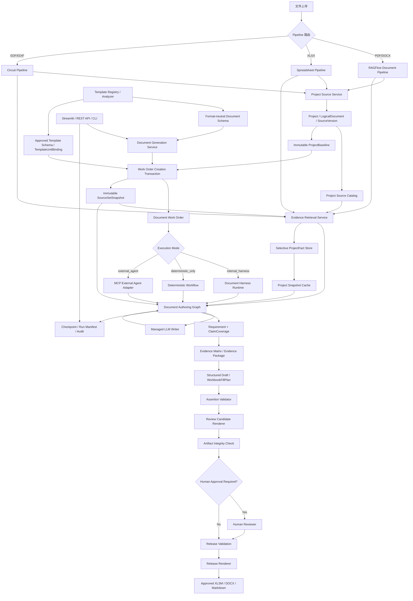

# Hardware-DataBase 内置文档生成 Harness 与可选外部智能体接入改造方案（V6）

> 代码审阅基线：当前集成工作区提交 `979d54528704`；合并或实施时仍应记录对应的上游 `develop` 提交 SHA，V6 修订日期为 2026-07-22。
>
> 适用对象：项目维护者、后端开发者、RAG/Agent 开发者、硬件领域工程师。
>
> 核心目标：在不推翻现有 RAGFlow、Spreadsheet、Circuit 和 LangGraph 查询链路的前提下，为 Hardware-DataBase 增加可独立运行的文档生成功能。系统通过内置 Document Harness 编排模板分析、需求拆解、证据检索、受管 Writer、验证和渲染，在不安装 Claude Code、不配置 MCP 的环境中也能生成可验证、可追溯、可增量更新的 XLSM、DOCX 或 Markdown；Claude Code、Codex 等外部智能体仅作为可选接入方式。
>
> V6 修订重点：在保留 V5 总体架构和分阶段路线的基础上，明确“无 ProjectSnapshot 也能由 Document Schema 驱动检索”，补充项目共享授权、不可变 SourceSetSnapshot、统一 RetrievalOutcome、确定性规则契约、区域前置过滤、审批内容 hash 绑定、正交 Artifact 状态和跨存储迁移切换契约。

---

## 1. 执行摘要

当前 `develop` 分支已经具备较完整的多源 Agentic 查询基础：

- 文档通过 RAGFlow 上传、解析和检索；
- Excel 通过本地结构化表格索引检索；
- EDF/EDIF 电路通过本地结构化电路索引检索；
- LangGraph 负责问题拆解、来源扫描、检索规划、多轮检索、证据合并和回答验证；
- Pipeline 与 Agent 层已经分别具备证据表示和转换链路，并已有 `Claim`、`ClaimCoverage`、`EvidenceCapability` 和 `AnswerAssertion` 等声明—证据模型；但二者尚不是单一统一模型，需要在领域服务边界收敛为稳定的 `EvidenceEnvelope`；
- 已具备 RAGAS 评估子系统和覆盖多源、冲突、缺失证据、权限等场景的测试集。

因此，本次改造不应重新建设一套平行 RAG、平行证据模型或强制所有解析器输出完整通用知识图谱，而应采用渐进式路线：

```text
P0  安全治理与回归基线
 ↓
P0.5  XLSM 保真/安全与 RAGFlow 严格选源技术 PoC
 ↓
P1  Project-first 项目、版本和来源治理
 ↓
P2a 文档契约、人工批准 Schema 与确定性 XLSM 评审文档 MVP
 ↓
P2b 有界检索、Managed Writer 与语义辅助检查项
 ↓
P2c Worker、Checkpoint、暂停恢复与生产可靠性
 ↓
P3  DOCX/Markdown、批量任务与可选 MCP 外部接入
 ↓
P4  选择性 ProjectFact 与 ProjectSnapshot
 ↓
P5  根据真实需求建设跨来源知识图谱
```

首个可用闭环应优先实现：

```text
项目资料上传与解析
→ 强制项目、配置基线和来源版本过滤
→ 完成目标 XLSM 技术兼容性验证
→ 人工注册并固化首版模板 Schema
→ 从 Streamlit/REST API/CLI 创建文档工作单
→ 生成章节/字段/检查项级信息需求
→ 先以确定性工作流完成 5～8 个高价值检查项
→ 构建 Evidence Matrix
→ 生成 review_candidate XLSM 和验证报告
→ 再增量引入有界补检索与 Managed Writer 语义草稿
→ Assertion-Evidence 语义验证
→ 人工处理结论、N/A、责任人与签批
→ 重新验证并发布 approved_release XLSM
→ 输出缺失、冲突、模板污染、人工待审和格式完整性报告
```

---

## 2. 改造目标与非目标

### 2.1 改造目标

系统改造后应支持：

1. 用户可以通过 Hardware-DataBase 的 Streamlit、REST API 或 CLI 创建、查看、暂停、恢复和取消文档生成任务；
2. 所有项目事实检索都由服务端强制限定 `project_id`、权限和有效版本；
3. 可以将其他项目的 XLSM、DOCX 或 Markdown 模板转换成可审批的章节、字段、检查项和可写区域 Schema；
4. 内置 Document Harness 能够依据字段需要选择文档、Excel 或电路检索工具，并受到工具白名单、轮次、超时和预算限制；
5. 精确实现事实优先来自结构化数据，设计理由和测试结论来自受控文档检索；
6. 缺失信息保持 `TBD`，冲突信息显式保留；
7. 正式文档中的事实声明能够映射到具体证据；
8. 内置 Harness、确定性任务、可选外部智能体、Streamlit UI 和后台批量任务复用同一套领域服务、文档契约、验证器和渲染器；
9. 新文件或新版本上传后，可增量识别受影响 Artifact，并分类为需要重新验证、已过期或建议重新生成；
10. 现有问答 Agent 和现有评估集不发生明显回退；
11. 内置或外部智能体只产生结构化 Draft 或 FillPlan，不直接改写受控模板原件；
12. 正式评审结论、签名、责任人和关闭状态由人工确认并审批；
13. 不安装 Claude Code、不配置 MCP 时，Hardware-DataBase 仍能独立完成模板注册、文档生成、验证、渲染和下载闭环；
14. 内置 Harness 支持持久化状态、有限重试、断点恢复、模型/Prompt/工具策略版本记录和完整审计；
15. 文档产物明确区分 `draft_preview`、`review_candidate` 和 `approved_release`，人工审批后必须重新验证并由服务端发布，不允许用未审批草稿冒充正式产物；
16. 对项目资料按数据分类限制可使用的 Writer Provider、部署地域、日志保留和模型数据用途；
17. 首个 XLSM MVP 在进入完整功能开发前，已经通过目标模板的包级保真、安全策略和客户端可打开性 PoC。
18. 即使尚未建设 `ProjectFact` 和 `ProjectSnapshot`，系统也能依据已批准 Document Schema、ProjectBaseline 和 Source Set 生成信息需求并完成受控检索；
19. 项目数据和项目画像按项目共享，但只对具有项目成员身份、项目角色和来源权限交集的主体可见；
20. 每个新模板都必须先经过安全扫描、Schema 注册/审批和 Renderer 兼容验证，已批准后才能在不同项目上复用。

### 2.2 首版非目标

首版不要求：

- 将所有 PDF/DOCX 内容抽取为完整三元组事实；
- 建立覆盖所有实体和关系的通用知识图谱；
- 自动裁决全部工程冲突；
- 一次支持所有硬件文档类型；
- 支持复杂 PCB 图像视觉理解；
- 支持无约束的多智能体自主协作；
- 将内置 Harness 建设成可执行任意 Shell、Python、SQL 或文件操作的通用自治 Agent；
- 承诺“任意未知 XLSM/DOCX 模板零配置、零审批即可生成正式文档”；
- 将 `ProjectFact Store` 或 `ProjectSnapshot` 建设成原始项目文档、全文索引或 Evidence Store 的副本；
- 允许外部智能体直接访问 SQLite、任意文件路径或任意 SQL；
- 允许任何内置或外部智能体直接修改受控 XLSM/DOCX 模板的二进制内容；
- 以 LLM 语义判断取代必要的工程评审和人工签批；
- 在首版自动识别所有模板可写区域，或让 LLM 直接决定 XLSM 包级修改位置；
- 承诺模型供应商不支持幂等键时“模型网络调用绝不重复”；系统保证的是重复执行不会产生重复提交的 Draft、审批状态或正式 Artifact；
- 将来源、模型、Prompt 或软件版本的任意变化都无差别地判定为同一种 `stale` 状态。

---

## 3. 当前架构基线与复用原则

### 3.1 必须保留的现有能力

| 现有能力 | 处理原则 |
|---|---|
| RAGFlow 文档 Pipeline | 保留为 PDF/DOCX 等非结构化文档的唯一主检索后端 |
| Spreadsheet Pipeline | 保留结构化语义行、单元格和工作簿 Profile 查询 |
| Circuit Pipeline | 保留电路实体、网络、模块和连接关系领域模型 |
| LangGraph Query Agent | 保留问答用途，避免将文档任务硬塞入同一状态模型 |
| Evidence 表示与适配 | 盘点 Pipeline/Agent 两种现有表示，在领域边界统一为 EvidenceEnvelope，不新建平行证据底座 |
| Claim/ClaimCoverage | 扩展为字段级和章节级证据要求，不另建完全重复模型 |
| RAGAS 评估 | 扩展文档任务指标，持续用于每个阶段回归 |
| Pipeline Contract | 保持各类 Pipeline 同级自治，不建立新的大一统解析器入口 |

> 实施前需先完成 Evidence Contract 盘点：当前 Pipeline 层 dataclass Evidence 与 Agent 层 Pydantic Evidence 仍是两种表示。目标是在领域服务边界形成唯一 `EvidenceEnvelope`，而不是默认已存在单一类。

### 3.2 总体设计原则

#### Project-first

知识库仍是存储、权限和治理容器，但项目事实工作必须显式绑定 `project_id`。

#### Capability-driven

文档 Schema 描述需要什么能力，例如实体查询、关系查询、表格查询和版本查询；具体调用哪个工具由检索策略决定。

#### Deterministic before semantic

```text
精确结构化查询
> 结构化关系查询
> 受过滤的关键词/全文检索
> 向量语义检索
> LLM 推断
```

#### Evidence before prose

Writer 只能读取已进入 Evidence Matrix 的证据，不直接读取整个知识库的任意检索结果。

#### Contract before authoring

固定模板的章节、字段、检查项和可写区域由 Hardware-DataBase 管理的 Schema 决定。对开放式文档，内置 Harness 或可选外部智能体可以提议大纲，但大纲必须固化到 Work Order 后才能撰写。

#### Runtime and responsibility separation

```text
Internal Harness       状态编排、有限规划、受控工具调用、重试和恢复
Managed Writer         基于 Evidence Package 产生结构化语义草稿
Hardware-DataBase      文档契约、项目基线、检索、规则、验证、渲染和审计
Optional External Agent 通过相同服务契约提交 Draft/FillPlan，不是默认依赖
Human Reviewer         工程判断、N/A 批准、评审结论、责任承诺和签名
```

Harness 是 Hardware-DataBase 内的 Agent 运行时和流程编排器，不是数据库、底层解析器、自由文件编辑器或最终正确性的裁决者。模板格式解析、权限、版本过滤、确定性规则、二进制写入和产物完整性检查仍由领域服务完成。

#### Format-neutral core, format-specific adapters

Document Schema、Evidence Matrix、Draft Assertion 和 Validation Report 与输出格式解耦；XLSM、DOCX 和 Markdown 只在 Template Adapter 和 Artifact Renderer 层保留各自的格式契约。

#### Selective fact projection

只将高价值、稳定且可验证的事实物化为 `ProjectFact`，不要求所有文本内容事实化。

#### Schema-driven without snapshot

`ProjectFact` 和 `ProjectSnapshot` 是后续性能与一致性优化，不是文档生成的正确性前置。在没有项目画像时，系统按以下链路决定需要检索的内容：

```text
Approved Document Schema 中的字段/检查项
→ InformationRequirement
→ Retrieval Policy / Deterministic Rule
→ Work Order 冻结的 SourceSetSnapshot
→ Circuit / Spreadsheet / RAGFlow 受控查询
→ Evidence Matrix
```

Snapshot 存在时可作为首层候选事实和规划上下文；Snapshot 缺失、失效或权限不允许时，必须回退到冻结来源上的直接检索，不得因此扩大来源范围。

#### Authorization intersection

项目可访问来源必须由服务端计算，有效范围为：

```text
项目成员/角色权限
∩ ProjectKnowledgeBinding
∩ KB/Department 来源权限
∩ ProjectSourceBinding / BaselineItem
∩ SourceRegionPolicy
∩ 数据分类和用途政策
```

项目画像是项目级共享资产，不为每个用户重复建设；但共享不等于公开，每次读取 Snapshot、Evidence Package 和 Artifact 仍需重新执行服务端授权。

#### Explicit unknown and conflict

缺失、冲突、旧版本和作用域不匹配必须是正式状态，不能由模型静默修正。

---

## 4. 目标架构



### 4.1 关键架构边界

- 本文的 `Hardware-DataBase` 指包含领域服务、Pipeline、验证器和渲染器的应用系统，不是让关系数据库本身承担 LLM 写作或文件渲染；
- 三类 Pipeline 继续拥有自己的解析和索引模型；
- 共享层统一的是来源身份、项目作用域和 Evidence Envelope，而不是强行统一全部内部数据；
- `ProjectSnapshot` 是可失效、可重建的缓存，不是权威来源；
- `review_candidate` 是供人工检查的受控草稿，不等于正式发布物；`approved_release` 只能在非终审人工事件完成、最终待批候选物重新验证，并对其精确内容 hash 完成批准后生成；
- 内置 Document Harness 是默认执行路径，通过领域服务调用工具，不直接访问底层数据库和任意文件；
- `deterministic_only` 模式用于完全不调用 LLM 也能完成的固定字段和规则检查，并作为 P2a 首版检查单的默认模式；P2b 引入语义辅助后，兼容 Schema 才默认使用 `internal_harness`；
- MCP 是可选外部适配层，不是 Hardware-DataBase 独立生成文档的运行前提；
- 任何内置或外部智能体都不直接改写受控模板，只产生带 Evidence ID 的 Draft 或 FillPlan；
- Hardware-DataBase 负责最终格式渲染、验证报告和产物审计；
- 正式评审结论和签名是人工权限，不由 LLM 自动生成；
- 长任务必须持久化 Work Order、Harness Run 和 Checkpoint，支持服务重启后恢复；
- 完整知识图谱不是文档 MVP 的前置条件。

### 4.2 文档生成职责矩阵

| 工作 | Internal Document Harness | Optional External Agent | Hardware-DataBase Domain Services | Human Reviewer |
|---|---|---|---|---|
| 用户意图和任务启动 | 读取已校验 Work Order | 可请求创建 Work Order | UI/API 参数校验、权限和持久化 | 提供业务目标 |
| 项目、配置基线、来源和权限 | 只能读取受信上下文 | 只能读取受信上下文 | 负责 | 必要时确认归属 |
| 模板包、宏、公式和样式解析 | 不直接解析文件包 | 不直接解析文件包 | Template Adapter 负责 | 审批风险策略 |
| 固定模板的章节/字段/检查项 | 按批准 Schema 编排 | 按批准 Schema 执行 | 管理 Schema 和可写区域 | 首次注册审批 |
| 开放式文档大纲 | 生成候选 | 可生成候选 | 固化到 Work Order | 必要时确认 |
| 检索规划和有限补检索 | 负责 | 可提出请求 | 执行选源、过滤、查询和记录 | — |
| 确定性字段/规则检查 | 调用规则 | 不重复实现 | 负责 | 审阅异常 |
| 语义段落、问题描述和措施建议 | 调用 Managed Writer | 提交带 Evidence ID 的草稿 | 限定输入并验证输出 | 确认或修改 |
| Checkpoint、重试、恢复和预算 | 负责执行策略 | 由外部运行时负责 | 存储、限额和审计 | 可暂停或终止 |
| Pass/Fail、N/A、责任人、关闭和签名 | 不得虚构 | 不得虚构 | 权限、前置检查和审计 | 负责 |
| XLSM/DOCX/Markdown 文件写入 | 只提交 Draft/FillPlan | 只提交 Draft/FillPlan | Renderer 负责 review candidate 和 approved release | 审阅候选产物并提交审批事件，不直接覆盖正式产物 |

该边界使 Hardware-DataBase 在没有 Claude Code、Codex 和 MCP 的部署中也能独立生成文档：P2a 通过 Streamlit/内部 Python API 完成闭环，P3 再提供受认证 REST API 和业务 CLI。外部智能体只是复用相同 Work Order、Evidence、Validator 和 Renderer 的可选 Orchestrator，不是权限实现、项目事实库或模板文件编辑器。

---

## 5. P0：安全治理与基线整理

当前仓库 README 已提示根目录 `.env` 曾包含真实 API Key。所有功能改造前必须先完成安全治理。

### 5.1 必做任务

1. 撤销和轮换曾经提交过的全部有效密钥；
2. 从当前分支及必要的 Git 历史中移除敏感内容；
3. 仓库只保留无敏感值的 `.env.example`；
4. 增加 pre-commit 和 CI secret scanning；
5. 检查 Streamlit 配置页面写回 `.env` 的目标路径，避免写入版本控制目录；
6. 建立 SQLite schema migration 机制；
7. 固化现有 Query Agent、Pipeline 和 RAGAS 回归基线；
8. 记录当前关键指标，作为后续 PR 的回归比较基准；
9. 用 commit SHA 而不是只用分支名固定改造基线，并记录工作区中已集成但尚未进入上游 `develop` 的能力。

### 5.2 验收标准

- 仓库及主要历史范围不再包含可用密钥；
- 新密钥提交会被 CI 拒绝；
- migration 可重复执行，并至少支持可控的向前迁移；
- 当前 25 条评估样例和主要单元测试通过。

### 5.3 P0.5：两项阻断性技术 PoC

P0 完成后、P1 大规模数据模型改造前，必须先验证两个最可能改变方案成本和边界的技术假设。

#### PoC-A：目标 XLSM 包级保真与安全

以首版 CAM 检查单执行最小化写入实验，至少验证：

```text
复制不可变原模板
→ 只修改 3～5 个 allowlist 单元格
→ 不新增或执行公式/VBA
→ 生成修改前后 OOXML Part Manifest 和 relationship diff
→ 检查 VBA、公式、数据验证、控件、图片、嵌入对象、外部链接和 calc 属性
→ 使用受支持版本的 Microsoft Excel 打开、保存和重新打开
→ 根据部署要求补充 LibreOffice 兼容性检查，但不将其结果等同于 Excel 保真
```

PoC 必须明确采用“OOXML 包级定点补丁”还是经过验证的专用库。未经验证，不得使用会静默删除 VBA、控件、外部关系或嵌入对象的通用工作簿保存流程。模板中存在的宏、外部链接和嵌入对象均视为主动内容；默认策略是 `quarantine/strip`，只有经过 hash/signature allowlist 和人工批准的资产才可 `preserve`。

#### PoC-B：RAGFlow 严格选源与错误语义

验证 RAGFlow 是否能按选定 document IDs 或等价条件执行服务端过滤，并测试：

- metadata 缺失或过滤不兼容时不扩大到未授权/未选定来源；
- top-k 在项目和 Source Set 过滤之后生效，避免全局 top-k 后置过滤造成假缺失；
- sheet/section/range 的 allow/deny Region Policy 在排序和 top-k 之前生效，不允许先取回 deny 区域再在应用层删除；
- RAGFlow chunk 与本地结构定位之间存在可重放的 locator/quote span 映射；如果后端不能提供稳定 section 过滤，必须通过批准章节分批检索或本地结构定位层实现；
- 指定来源不可用、检索后端失败和真正零结果分别返回 `source_unavailable`、`retrieval_failed` 和 `missing`；
- 若后端不支持严格 document ID 过滤，则采用按文档分批检索或受控过取样，不允许正式文档链路无条件全局 fallback。

#### P0.5 退出条件

- 目标 XLSM 的受支持/不受支持 Part 清单、客户端兼容矩阵和 Renderer 技术路线已经形成书面结论；
- 在批准策略下，PoC 产物能被目标 Excel 客户端打开且格式完整性硬门槛通过；
- 严格选源不会泄漏其他项目，并能区分零结果、后端失败和来源不可用；
- 区域过滤不会让 Example、Template instructions、Definition、change history 或 hidden internal 区域进入候选 Evidence，且过滤后 top-k 行为已经量化验证；
- 若任一 PoC 不通过，先调整首版模板或检索架构，不带着未知风险进入 P2。

---

## 6. P1：Project-first 项目和来源治理

这是本次改造中优先级最高的业务阶段。

### 6.1 数据模型

#### Project

```python
class Project(BaseModel):
    project_id: str
    tenant_id: str
    department_id: str
    name: str
    product_type: str | None = None
    lifecycle_stage: str | None = None
    current_hardware_revision: str | None = None
    current_bom_revision: str | None = None
    status: Literal["active", "archived", "draft"] = "active"
    metadata: dict[str, Any] = Field(default_factory=dict)
```

#### ProjectKnowledgeBinding

项目与知识库采用多对多绑定，而不是在 `Project` 中直接保存 `kb_names`。

```python
class ProjectKnowledgeBinding(BaseModel):
    binding_id: str
    project_id: str
    tenant_id: str
    kb_id: str
    owner_department_id: str
    kb_name_snapshot: str = ""  # 仅用于显示/审计，不作为权限或关联键
    binding_type: Literal[
        "project_private",
        "shared_standard",
        "component_library",
        "template_library",
    ]
    priority: int = 0
    allowed_source_roles: list[str] = Field(default_factory=list)
```

#### ProjectPrincipalBinding

项目共享需要显式成员/用户组绑定，不能只在 `RequestContext` 中传入一个没有持久化来源的 `allowed_projects`：

```python
class ProjectPrincipalBinding(BaseModel):
    binding_id: str
    tenant_id: str
    project_id: str
    principal_type: Literal["user", "group", "department", "service_account"]
    principal_id: str
    project_role: Literal[
        "viewer", "author", "reviewer", "approver", "project_admin"
    ]
    capabilities: list[str] = Field(default_factory=list)
    valid_from: datetime | None = None
    valid_to: datetime | None = None
    status: Literal["active", "suspended", "revoked"] = "active"
```

同一项目的授权用户共享项目级 `ProjectFact` 和 `ProjectSnapshot`，但读取正文、提交人工事件、审批和下载正式 Artifact 使用独立 capability。系统管理员只有治理权限时，不因其全局角色自动获得项目正文读取权限。

`tenant_id` 不能只出现在部分对象中。若首版确定为单租户，应显式记录 `deployment_tenancy=single_tenant` 并在模型中暂不暴露伪多租户能力；若支持多租户，则 Project、KB binding、LogicalDocument、SourceVersion、ProcessingArtifact、Baseline、WorkOrder、Evidence、Artifact 及其数据库唯一约束/外键都必须包含或可传递验证 tenant scope，禁止仅依赖全局唯一字符串 ID 隔离租户。

#### SourceAsset

表示物理上传文件及内容身份。

```python
class SourceAsset(BaseModel):
    asset_id: str
    tenant_id: str
    pipeline_record_id: str | None = None  # 兼容现有台账，不作为资产主身份
    original_file_name: str
    content_hash: str
    content_kind: str
    parser_kind: str
    processing_status: str
    storage_ref: str | None = None
    data_classification: Literal[
        "public", "internal", "confidential", "restricted"
    ] = "internal"
```

#### LogicalDocument

表示业务上的“同一份文档”。

```python
class LogicalDocument(BaseModel):
    document_id: str
    tenant_id: str
    title: str
    document_role: str
    owner_department_id: str
    metadata: dict[str, Any] = Field(default_factory=dict)
```

#### SourceVersion

```python
class SourceVersion(BaseModel):
    version_id: str
    tenant_id: str
    document_id: str
    asset_id: str
    revision: str | None
    approval_status: Literal[
        "draft", "reviewing", "approved", "released", "obsolete"
    ]
    effective_from: datetime | None
    effective_to: datetime | None
    predecessor_version_ids: list[str] = Field(default_factory=list)
```

`SourceVersion` 表示业务版本，不应被解析器升级直接修改。解析和索引产物建议独立建模：

```python
class ProcessingArtifact(BaseModel):
    artifact_id: str
    tenant_id: str
    asset_id: str
    processor_kind: str
    processor_version: str
    backend_locator: dict[str, Any]
    content_fingerprint: str
    status: Literal["processing", "ready", "failed", "superseded"]
    created_at: datetime
```

同一 SourceVersion 可对应多个 ProcessingArtifact，从而在不制造虚假业务版本的前提下支持重新解析和索引升级。

#### ProjectSourceBinding

```python
class ProjectSourceBinding(BaseModel):
    binding_id: str
    tenant_id: str
    project_id: str
    version_id: str
    module_scope: list[str] = Field(default_factory=list)
    usage_type: Literal[
        "project_fact",
        "shared_reference",
        "template_only",
        "historical_reference",
    ]
    status: Literal["active", "inactive", "pending_review"] = "active"
```

#### ProjectBaseline

单一 `target_revision` 不足以表示 BOM、主板、子板、需求、接口和测试报告的不同版本序列。文档任务应优先绑定配置基线：

```python
class ProjectBaseline(BaseModel):
    baseline_id: str
    tenant_id: str
    project_id: str
    name: str
    baseline_version: int = 1
    content_hash: str
    product_variant: str | None = None
    hardware_revisions: dict[str, str] = Field(default_factory=dict)
    items: list["BaselineItem"] = Field(default_factory=list)
    effective_at: datetime | None = None
    status: Literal["draft", "approved", "released", "obsolete"]
    created_at: datetime
    approved_by: str | None = None
    approved_at: datetime | None = None
```

Baseline 不能只保存无语义的 SourceVersion ID 列表。每个条目必须说明它代表哪个配置项、来源角色和模块：

```python
class BaselineItem(BaseModel):
    baseline_item_id: str
    config_item_key: str       # 例如 main_board_schematic / released_bom
    source_role: str
    source_version_id: str
    module_scope: list[str] = Field(default_factory=list)
    product_variant: str | None = None
    required: bool = True
```

显式批准的 BaselineItem 是文档任务的权威输入。“当前版本计算”只用于创建基线时推荐候选，不能在运行中替代已冻结条目。

`approved/released` BaselineVersion 不得原地修改 items；任何变更都创建新的 `baseline_version + content_hash`。为避免 Work Order 创建后、Worker 开始前输入漂移，必须在创建 Work Order 的同一事务中生成不可变来源集：

```python
class SourceSetSnapshot(BaseModel):
    source_set_snapshot_id: str
    tenant_id: str
    work_order_id: str
    project_id: str
    baseline_id: str
    baseline_content_hash: str
    baseline_item_ids: list[str]
    source_version_ids: list[str]
    shared_reference_version_ids: list[str] = Field(default_factory=list)
    processing_artifact_ids: list[str]
    region_policy_versions: dict[str, str]
    authorization_snapshot_id: str
    content_hash: str
    created_at: datetime
```

`SourceSetSnapshot` 冻结“这次任务允许使用哪些版本、解析产物和区域策略”，不冻结用户未来的访问权。每次运行、恢复和下载仍需用当前认证主体重新校验权限。

#### SourceRegionPolicy

实际项目 Excel/DOCX 往往同时包含当前项目事实、模板说明、Example、Definition 和变更历史。因此不能只在文件级设置 `usage_type`，还需要工作表/章节/区域级策略：

```python
class SourceRegionPolicy(BaseModel):
    region_policy_id: str
    source_version_id: str
    locator: dict[str, Any]
    region_type: Literal[
        "project_fact",
        "template_instruction",
        "example",
        "definition",
        "change_history",
        "formula_result",
        "hidden_internal",
    ]
    allowed_evidence_uses: list[str] = Field(default_factory=list)
    decision: Literal["allow", "deny"] = "deny"
    priority: int = 0
    classification_confidence: float | None = None
    approved_by: str | None = None
    approved_at: datetime | None = None
    processing_artifact_id: str
```

例如 ADAS ICD 中的 `Pin Definition` 可作为项目证据，`Example` 必须默认排除；带 `Template instructions` 和 `Template change history` 的工作表不能因整个工作簿被标记为 `project_fact` 而进入当前项目事实。

Region Policy 采用默认拒绝：未分类区域、相互重叠且优先级相同的策略、低置信度自动分类以及 locator 已因重新解析失效的区域，都不能作为正式证据。P2a 首版使用人工批准的 sheet/range allowlist；LLM 分类只能产生候选策略。

### 6.2 为什么拆分模型

拆分后可以正确处理：

- 同一逻辑文档的多个版本；
- 同一版本的重新上传或重新解析；
- 公共数据手册被多个项目引用；
- 模板文件只能提供结构和风格，不能提供当前项目事实；
- 草稿、批准、发布和废弃状态；
- 分支版本和非线性替代关系；
- 文件内容未变化但解析器版本发生变化。
- 同一业务版本产生多个可审计的解析/索引产物；
- 同一复合文件中的项目事实区域与模板、样例区域分离；
- 文档生成固定到可审计重放的 ProjectBaseline，而不是模糊的单一版本字符串。

### 6.3 RequestContext 扩展

在现有 `RequestContext` 基础上增加可信项目上下文：

```python
@dataclass
class RequestContext:
    # 保留现有字段
    user_id: str = "anonymous"
    session_id: str = ""
    roles: list[str] = field(default_factory=list)
    allowed_kbs: list[str] = field(default_factory=list)
    kb_permissions: dict[str, str] = field(default_factory=dict)
    metadata: dict[str, Any] = field(default_factory=dict)

    # 新增
    tenant_id: str | None = None
    project_id: str | None = None
    allowed_projects: list[str] = field(default_factory=list)
    project_roles: dict[str, str] = field(default_factory=dict)
    project_capabilities: dict[str, list[str]] = field(default_factory=dict)
    baseline_id: str | None = None
    target_revision: str | None = None  # 仅作兼容/查询提示，不替代 baseline
    effective_at: datetime | None = None
    module_scope: list[str] = field(default_factory=list)
```

服务端必须重新校验 `project_id`，不能仅相信 MCP 或 LLM 传入值。

`allowed_projects`、角色和来源权限必须由认证主体在服务端解析，不作为外部工具可写参数。普通问答可以保留 `project_id=None`，但所有文档 Work Order、Evidence Package、Validate 和 Render 端点都必须拒绝缺失认证上下文或项目基线的请求。

`project_roles/project_capabilities` 是当前认证结果的短命快照，其权威来源是 `ProjectPrincipalBinding` 和组/部门目录。服务方法不得因为 RequestContext 已含该字段而跳过数据库或策略引擎的最终授权。

### 6.4 Project Source Catalog

将现有 Pipeline Catalog 升级为项目来源目录，至少返回：

```json
{
  "version_id": "src-ver-bom-1.8",
  "logical_document": "主控板 BOM",
  "document_role": "released_bom",
  "module_scope": ["main_board"],
  "revision": "V1.8",
  "approval_status": "released",
  "effective_from": "2026-07-01",
  "usage_type": "project_fact",
  "current_for_context": true,
  "domains": ["components", "supply_chain"],
  "summary": "主控板当前发布 BOM"
}
```

### 6.5 RAGFlow 与本地索引改造

- 上传 RAGFlow 时同步 `project_id`、`version_id`、`document_role`、`approval_status` 和 `module_scope`；
- 文档检索先从本地 Project Source Catalog 选定允许的 RAGFlow document IDs；
- Spreadsheet 和 Circuit 索引记录补充 `project_id`、`version_id` 和模块作用域；
- Excel/DOCX 在检索前应用 SourceRegionPolicy，排除 Example、Template instructions、Definition 和隐藏内部区域；
- 服务端默认仅检索目标时间点有效的来源；
- `template_only` 来源绝不能作为当前项目事实证据。

### 6.6 当前版本判定

不建议维护可被任意修改的 `is_current` 布尔字段，也不得对 `Rev A`、`V1.10` 等非统一版本字符串做词法“大小”比较。当前版本候选应由以下条件计算：

```text
项目绑定有效
+ 审批状态满足策略
+ effective_at 位于生效区间
+ 版本替代关系未指向更高优先版本
+ 模块作用域匹配
```

必须额外定义并验证：替代关系无环、同一配置项和作用域在同一有效时间点最多一个 released 候选、有效期不非法重叠、审批状态迁移合法，以及出现并列候选时进入人工裁决而不是自行选择“更高版本”。必要时可缓存判定结果，但缓存必须可失效。

文档运行时不重新计算“当前版本”，只读取 Work Order 已冻结的 BaselineItem 和 Source Set。这样可避免长任务中途因来源发布而静默改变输入。

---

## 7. Evidence Envelope：在领域边界统一，而不是默认现有类已统一

现有项目的 Pipeline 层和 Agent 层已有证据模型与转换链路，但尚非单一类。本次改造应保留 Pipeline 内部自治模型，在共享领域服务边界统一转换为 `EvidenceEnvelope`，并增加项目、配置基线、来源版本、区域定位和事实类型信息。

### 7.1 建议扩展字段

```python
@dataclass
class EvidenceEnvelope:
    id: str
    content: str
    source_name: str = ""
    source_type: str = "document"
    score: float = 0.0
    metadata: dict[str, Any] = field(default_factory=dict)
    backend: str = "ragflow"
    retriever: str = ""

    # 新增
    project_id: str | None = None
    baseline_id: str | None = None
    source_version_id: str | None = None
    processing_artifact_id: str | None = None
    document_role: str | None = None
    module_scope: list[str] = field(default_factory=list)
    revision: str | None = None
    approval_status: str | None = None
    effective_from: datetime | None = None
    effective_to: datetime | None = None
    locator: dict[str, Any] = field(default_factory=dict)
    fact_type: str | None = None
    certainty: str = "retrieved_statement"
    authority_policy_id: str | None = None
    content_hash: str = ""
    quote_span: dict[str, Any] | None = None
    lineage_group_id: str | None = None
    retrieved_at: datetime | None = None
```

Evidence 身份拆为两个概念：

```text
evidence_occurrence_id  不可变，建议由 source_version_id + processing_artifact_id + locator + content_hash 生成
semantic_anchor_id      可选，用于表示跨重新解析仍指向“同一逻辑位置”的稳定锚点
```

正式 Assertion 必须引用不可变的 `evidence_occurrence_id`；内容、定位或解析产物变化后必须产生新 occurrence ID，不能让同一 Evidence ID 指向不同内容。`quote_span` 保存实际支持断言的最小文本/单元格/关系范围，避免只引用一个过大的 chunk。对 shared reference，还应在 metadata/provenance 中区分“当前检索项目”与“来源所有者/公共来源”，不应通过修改来源归属来表示项目可用性。

`independent_source_count` 按 `lineage_group_id` 和逻辑文档血缘计算，而不是简单统计 Evidence 或文件数量；同一文档的多个 chunk、复制件和重新解析产物不能被当作多个独立来源。

### 7.2 Fact Type

建议统一支持：

```text
PROJECT_IMPLEMENTATION
PROJECT_REQUIREMENT
COMPONENT_SPEC
MEASURED_RESULT
DERIVED_VALUE
ENGINEERING_GUIDELINE
HISTORICAL_DECISION
TEMPLATE_LEGACY_CLAIM
```

这可以避免将数据手册最大规格误写为当前项目实际配置。

### 7.3 Locator

不同 Pipeline 保留自己的精确定位：

```text
RAGFlow: document_id / chunk_id / page / section
Excel: record_id / sheet / row / cell / header
Circuit: board / module / entity_id / designator / net / path
```

上层只依赖统一 `locator` 字段，不要求底层内部模型相同。

---

## 8. 复用 Claim 能力，但分离信息需求、事实和草稿断言

问答链路中的 `Claim` 实际上同时承担“需要查什么”和“需要证明什么”两种含义。文档生成中，“需要填写输入电压范围”在检索前还不是一个事实 Claim。建议保留现有 capability 规划能力，但显式区分：

```text
InformationRequirement  文档章节/字段/检查项需要什么信息
ResolvedClaim           经过证据验证后得到的规范化事实
DraftAssertion          Managed Writer 或可选外部智能体实际写出的可验证断言
```

### 8.1 InformationRequirement

```python
class InformationRequirement(BaseModel):
    requirement_id: str
    section_id: str
    field_id: str | None = None
    review_item_id: str | None = None
    description: str
    operation: ClaimOperation
    subject_terms: list[str] = Field(default_factory=list)
    required_capabilities: list[CapabilityName] = Field(default_factory=list)
    expected_value_type: str | None = None
    expected_unit: str | None = None
    verification_policy_id: str
    required: bool = True
    missing_policy: Literal["mark_tbd", "block_section", "human_review"] = "mark_tbd"
```

### 8.2 扩展 Claim

现有 `Claim` 已包含 operation、subject_terms、required_capabilities 和 support_mode。建议扩展为：

```python
class Claim(BaseModel):
    id: str
    text: str
    operation: ClaimOperation
    subject_terms: list[str] = Field(default_factory=list)
    required_capabilities: list[CapabilityName] = Field(default_factory=list)
    support_mode: Literal["direct", "composite", "inference_allowed"] = "direct"
    required: bool = True

    # 文档任务扩展：仅在形成待验证事实后使用
    section_id: str | None = None
    field_id: str | None = None
    project_id: str | None = None
    module_scope: list[str] = Field(default_factory=list)
    baseline_id: str | None = None
    source_version_scope: list[str] = Field(default_factory=list)
    expected_value_type: str | None = None
    expected_unit: str | None = None
    verification_policy_id: str | None = None
    missing_policy: Literal["mark_tbd", "block_section", "optional"] = "mark_tbd"
```

### 8.3 扩展 ClaimCoverage

当前覆盖状态只有 supported、partial、conflicting 和 missing，建议增加验证维度：

```python
class ClaimCoverage(BaseModel):
    claim_id: str
    status: Literal[
        "unsearched",
        "supported",
        "partial",
        "conflicting",
        "missing",
        "retrieval_failed",
        "access_denied",
        "source_unavailable",
        "requires_human",
    ]
    evidence_ids: list[str] = Field(default_factory=list)
    missing_capabilities: list[CapabilityName] = Field(default_factory=list)
    conflict_evidence_ids: list[str] = Field(default_factory=list)

    semantic_support: Literal[
        "not_checked", "supported", "partial", "unsupported"
    ] = "not_checked"
    scope_status: Literal["matched", "mismatched", "unknown"] = "unknown"
    revision_status: Literal["current", "outdated", "unknown"] = "unknown"
    authority_status: Literal["sufficient", "insufficient", "unknown"] = "unknown"
    independent_source_count: int = 0
    validation_notes: list[str] = Field(default_factory=list)
```

`retrieval_failed` 不得降级为 `missing/TBD`。只有在授权来源查询成功但无证据时，才能判定 `missing`。正式文档链路必须 fail-closed，不沿用问答 Agent 的 fail-open 错误策略。

### 8.4 RetrievalOutcome：在工具边界区分空结果与失败

不能继续让 RAGFlow、Spreadsheet 和 Circuit 工具仅返回 `list[Evidence]`。否则数据库连接失败、过滤不兼容和真实零结果都会被折叠为空列表，上层无法实现 fail-closed。

```python
class RetrievalSourceOutcome(BaseModel):
    source_version_id: str
    processing_artifact_id: str | None = None
    status: Literal[
        "success_with_hits",
        "success_empty",
        "source_unavailable",
        "retrieval_failed",
        "access_denied",
        "filter_unsupported",
    ]
    evidence_ids: list[str] = Field(default_factory=list)
    error_code: str | None = None
    retryable: bool = False
    diagnostics: dict[str, Any] = Field(default_factory=dict)


class RetrievalOutcome(BaseModel):
    requirement_id: str
    status: Literal[
        "success_with_hits",
        "success_empty",
        "partial_failure",
        "retrieval_failed",
        "source_unavailable",
        "access_denied",
    ]
    evidences: list[EvidenceEnvelope] = Field(default_factory=list)
    source_outcomes: list[RetrievalSourceOutcome] = Field(default_factory=list)
    query_fingerprint: str
    applied_source_set_snapshot_id: str
    applied_region_policy_versions: dict[str, str]
```

只有所有必需来源都完成授权查询且没有返回 Evidence 时，Requirement 才能进入 `missing`。部分来源失败必须保留 `partial_failure`，不允许用其他来源的命中掩盖失败。该契约应在 Evidence Retrieval Service/Tool Adapter 边界生成，`ClaimCoverage` 只是对它的上层归纳，不负责猜测底层错误。

### 8.5 Evidence Matrix

`EvidenceMatrix` 不再作为另一套底层证据模型，而是 `InformationRequirement + ResolvedClaim + ClaimCoverage` 的文档视图：

```python
class EvidenceMatrixRow(BaseModel):
    section_id: str
    field_id: str | None = None
    review_item_id: str | None = None
    requirement: InformationRequirement
    resolved_claims: list[Claim] = Field(default_factory=list)
    coverage: ClaimCoverage
    normalized_value: Any | None = None
    display_value: str | None = None
    derivation: dict[str, Any] | None = None
```

### 8.6 修正当前覆盖判断

当前 capability 覆盖只能说明“证据具备可能支持该 Claim 的能力”，不能证明证据内容真正支持 Claim。

需要增加第二阶段验证：

```text
Capability coverage
→ Candidate evidence
→ Resolved Claim extraction
→ Claim-Evidence semantic entailment
→ Scope / revision / authority validation
→ Final coverage status
```

LLM 可参与语义蕴含判断，但服务端仍需执行确定性项目、版本和来源规则。

---

## 9. 文档模板与 Document Schema

### 9.1 Template Registry 与 Template Analyzer

模板是受控资产，必须保存不可变原件、内容 hash、版本、格式、数据分类和安全检查结果。Template Analyzer 可以由规则和 LLM 辅助产生候选 Schema，但首次注册必须经人工审批；运行时直接使用已批准 Schema，不重复猜测可写区域。P2a 首版 Schema 由规则/人工显式登记，自动 Template Analyzer 不进入首个生产闭环的关键路径。

模板解析分为两个边界清晰的阶段：

```text
Technical Parse（确定性 Template Adapter）
  读取 XLSM/XLSX/DOCX/Markdown 的包结构、工作表、单元格、公式、宏关系、样式、内容控件、书签和图片关系
  不执行宏，不调用来源文档中的指令，不判断工程语义

Semantic Analyze（Template Analysis Service + 可选 Managed Model）
  基于 Technical Parse 结果识别字段、章节、检查项、Legacy Claims、可写角色和候选输出绑定
  只产生待审批 Schema，不直接修改模板，也不把旧项目内容写入当前项目事实
```

内置 Harness 可以编排 Semantic Analyze 和必要的有限补充分析，但格式包读取、安全扫描和稳定 locator 生成必须由 Template Adapter 完成。已批准模板的每次文档生成直接复用固定 `TemplateVersion + TemplateSchemaVersion`，不得让 Harness 在运行时重新决定可写区域。

```python
class TemplateVersion(BaseModel):
    template_version_id: str
    template_id: str
    format: Literal["xlsm", "xlsx", "docx", "markdown"]
    content_hash: str
    template_schema_id: str
    template_schema_version: str
    renderer_policy_id: str
    status: Literal["draft", "approved", "obsolete"]
    security_report_id: str | None = None
```

### 9.2 Template Analyzer 输出

模板分析后保留五类信息：

```text
Structure      标题、章节、表格和编号
Style          语气、格式、固定段落和版式
Legacy Claims  旧项目型号、参数、接口和版本声明
Write Policy   可写、禁止修改、公式、人工填写和人工审批区域
Format Assets  宏、外部关系、图片、页眉页脚、编号、内容控件和书签
```

旧项目声明不直接丢弃，而是存为禁止用作当前事实的污染检测基准。

```python
class LegacyTemplateClaim(BaseModel):
    claim_id: str
    text: str
    locator: dict[str, Any]
    detected_entities: list[str] = Field(default_factory=list)
    legacy_value_kind: Literal[
        "project_fact",
        "review_result",
        "workflow_state",
        "person_or_signature",
        "example_text",
    ] = "project_fact"
    prohibited_as_project_evidence: bool = True
```

#### XLSM/XLSX 模板 Schema

```python
class WorkbookRegionSchema(BaseModel):
    region_id: str
    sheet_name: str
    locator: dict[str, Any]  # cell / range / table / named range
    role: Literal[
        "locked_template",
        "project_metadata",
        "evidence_derived",
        "semantic_draft",
        "formula",
        "human_input",
        "human_approval",
        "legacy_example",
    ]
    write_policy: Literal["never", "deterministic_only", "validated_draft", "human_only"]
    preserve_formula: bool = False
    value_type: str | None = None
```

Document Schema 中的语义单元通过独立的模板绑定映射到一个或多个已批准区域，位置不能反向混入语义 Schema：

```python
class TemplateUnitBinding(BaseModel):
    binding_id: str
    template_schema_id: str
    template_schema_version: str
    semantic_unit_type: Literal["section", "field", "review_item"]
    semantic_unit_id: str
    target_region_ids: list[str]
    render_transform_id: str | None = None
```

XLSM Renderer 必须从原模板复制新产物，对 allowlist 单元格执行最小化修改，不执行 VBA，并在导出后校验 VBA、公式、数据验证、控件、图片、嵌入对象、计算属性和包关系是否符合已批准的 Renderer Policy。外部链接、嵌入对象和宏分别设置 `preserve/strip/quarantine` 策略，不因“格式保真”默认保留未审批的主动内容。

额外安全规则：

- 只有 `formula` 角色允许写入公式；其他字段若以 `=`、`+`、`-`、`@` 等可触发公式/链接解释的形式写入，必须按文本转义或拒绝；
- VBA 必须通过内容 hash 或数字签名 allowlist，未签名/未知宏默认 quarantine；
- 外部链接默认 strip，确需保留时记录目标、风险审批和打开时行为；
- 不依赖服务端计算公式缓存值，必须明确 `calcMode/calcOnSave/fullCalcOnLoad` 策略，并在目标 Excel 客户端验证；
- Renderer 输出 OOXML Part Manifest、relationship diff 和策略判定，不能只通过“文件能打开”判断保真；
- 若模板含数字签名，任何修改可能使签名失效，必须定义重新签名或明确降级策略。

#### DOCX 模板 Schema

DOCX 应优先通过内容控件 tag、书签、稳定表格 ID 或显式 placeholder 定位，不依赖“第 17 段”等易变位置。Renderer 负责保留样式、编号、页眉页脚、目录、表格和图片关系。

### 9.3 Format-neutral Document Schema

Document Schema 是“文档应该包含什么、需要什么证据、如何验证”的格式中立语义契约，不直接硬编码具体文件位置或任意工具参数。`Template/WorkbookRegionSchema` 是“内容写到哪里”的格式定位契约，Renderer Policy 是“如何安全写入和保真”的文件契约。

```text
Document Schema     项目名称、主控型号、电源接口检查等语义单元
Template Schema     project_name → Sheet1!F6 / DOCX content-control:project_name
Renderer Policy     允许修改 F6，保留样式，禁止改写公式/VBA
```

同一 Document Schema 可绑定多个已批准模板；新模板只需重新建立 Template Schema/TemplateUnitBinding 并通过格式 PoC，不重写项目、证据和验证逻辑。未注册/未批准模板只能产生候选 Schema，不能直接生成正式文档。

```python
class DocumentFieldSchema(BaseModel):
    field_id: str
    label: str
    description: str
    required: bool
    value_type: str
    required_capabilities: list[CapabilityName]
    preferred_source_roles: list[str]
    retrieval_policy_id: str
    query_terms: list[str] = Field(default_factory=list)
    subject_aliases: list[str] = Field(default_factory=list)
    verification_policy_id: str
    value_normalizer_id: str | None = None
    allow_derivation: bool = False
    missing_policy: str = "mark_tbd"
    authoring_policy: Literal[
        "deterministic",
        "managed_writer",
        "external_agent_draft",
        "human_only",
    ] = "managed_writer"
```

示例：

```yaml
field_id: power_input_voltage
label: 输入电压范围
required: true
value_type: voltage_range
required_capabilities:
  - document_claim_lookup
  - relationship_lookup
  - revision_lookup
preferred_source_roles:
  - approved_requirement
  - released_schematic
  - interface_spec
retrieval_policy_id: power_requirement_and_implementation
query_terms:
  - input voltage
  - supply voltage range
subject_aliases:
  - VIN
  - VBAT
verification_policy_id: requirement_vs_implementation
allow_derivation: false
missing_policy: block_section
```

### 9.4 结构化评审项模型

```python
class ReviewItemSchema(BaseModel):
    review_item_id: str
    label: str
    applicability_policy_id: str
    evaluation_mode: Literal[
        "deterministic_auto",
        "semantic_assisted",
        "human_required",
    ]
    required_capabilities: list[CapabilityName]
    required_source_roles: list[str]
    retrieval_rule_id: str
    deterministic_rule_id: str | None = None
    pass_policy_id: str
    severity: Literal["info", "warning", "major", "critical"] = "warning"
```

评审项的运行结果必须区分：

```text
passed
failed
not_applicable_pending_approval
insufficient_evidence
requires_human
retrieval_failed
conflicting
```

Managed Writer 或可选外部智能体可以为 `semantic_assisted` 检查项生成“建议通过/建议不通过/建议 N/A”和理由，但不能直接代替需要评审组长确认的正式结论。

### 9.5 DeterministicRuleSpec

`deterministic_auto` 不能只是一个标签或 `pass_policy_id`，必须有可执行、可版本化、可用 golden fixture 验收的规则契约：

```python
class DeterministicRuleSpec(BaseModel):
    rule_id: str
    rule_version: str
    operation: Literal[
        "exact_match", "set_compare", "range_check", "regex_check",
        "existence_check", "count_compare", "derived_calculation",
    ]
    input_requirements: list[str]
    capability: CapabilityName
    approved_operation_name: str
    parameter_bindings: dict[str, Any]
    expected_value_type: str
    normalizer_id: str | None = None
    unit_policy_id: str | None = None
    tolerance: dict[str, Any] | None = None
    expected_cardinality: dict[str, int] | None = None
    missing_behavior: Literal["tbd", "insufficient_evidence", "block"]
    conflict_behavior: Literal["report", "block"] = "block"
    implementation_version: str
```

P2a 开工前必须锁定具体 5～8 项的 RuleSpec、Source/Region 范围、输入样例、预期 Evidence 和预期结果。“网络命名检查”等自然语言名称本身不是可验收规则。不需要 LLM 的规则不经过语义 Writer，运行时只允许调用 `approved_operation_name` 对应的服务端白名单操作。

### 9.6 首版文档类型

首版优先实现一个真实的结构化评审工作产品：

```text
schematic_design_review_checklist_xlsm
```

以 `22_825504681 825504682_CAM_硬件原理图设计评审检查单.xlsm` 为受控模板。检查项按增量交付，不在一个 PR 中同时承诺全部 15～20 项：

```text
P2a  5～8 个 deterministic_auto 检查项
P2b  再增加 5～10 个 semantic_assisted 检查项，使累计范围达到 15～20 项
P2c  不扩大检查项数量，集中验证恢复、并发和生产可靠性
```

累计检查项候选包括：

1. 项目、配置基线、原理图名称和评审材料列表；
2. 网络命名、器件/网络存在性和基本连接关系；
3. 需求、HSI、ICD 与 EDF 之间的关键接口差异；
4. 已有 FPT、Test Coverage 和 Hardware Debug 的覆盖摘要；
5. 冲突、缺失证据、需要人工检查和不可自动判定项。

Symbol、Partlist、BOM、CAD 模板依从、DRC、页面可读性和签字等未有充分结构化证据的项目，首版必须标记 `requires_human` 或 `insufficient_evidence`。

第二个文档类型再引入叙述性 DOCX/Markdown：

```text
hardware_design_spec
```

建议章节：

1. 项目与版本概述；
2. 系统架构；
3. 板卡和模块；
4. 主控及关键器件；
5. 电源设计；
6. 接口设计；
7. 关键电路与保护；
8. 功耗和热设计；
9. 验证状态；
10. 风险、冲突和待确认项。

---

## 10. Document Work Order

文档生成必须通过可持久化工作单管理。

```python
class DocumentWorkOrder(BaseModel):
    work_order_id: str
    tenant_id: str
    project_id: str
    baseline_id: str
    baseline_content_hash: str
    source_set_snapshot_id: str
    template_version_id: str
    document_schema_id: str
    document_schema_version: str
    template_schema_id: str
    template_schema_version: str
    retrieval_policy_version: str
    renderer_policy_version: str
    target_format: Literal["xlsm", "xlsx", "markdown", "docx"]
    execution_mode: Literal[
        "internal_harness",
        "deterministic_only",
        "external_agent",
    ]  # 创建时由批准的 Schema/Policy 明确决定，不使用隐式全局默认值
    harness_policy_id: str | None = None
    unit_statuses: dict[str, str]  # section / field / review item
    status: Literal[
        "planned",
        "retrieving",
        "ready_to_draft",
        "drafting",
        "waiting_human_input",
        "validating",
        "waiting_human_approval",
        "ready_to_render",
        "rendering",
        "blocked",
        "complete",
        "cancelled",
    ]
    project_snapshot_version: str | None = None
    evidence_matrix_id: str | None = None
    validation_report_id: str | None = None
    created_by: str
    created_at: datetime
    updated_at: datetime
    input_fingerprint: str
    idempotency_key: str | None = None
    run_manifest_id: str | None = None
    lock_version: int = 0
```

### 10.1 Artifact 生命周期

Work Order 状态与文件发布状态必须分离，避免“任务完成”等同于“正式文档已批准”。

```python
class DocumentArtifact(BaseModel):
    artifact_id: str
    tenant_id: str
    work_order_id: str
    run_id: str
    stage: Literal["draft_preview", "review_candidate", "approved_release"]
    validity_status: Literal["current", "artifact_stale", "revalidation_required"] = "current"
    policy_status: Literal["active", "policy_obsolete"] = "active"
    access_status: Literal["granted", "access_revoked"] = "granted"
    regeneration_status: Literal["not_needed", "recommended"] = "not_needed"
    status_reasons: list[dict[str, Any]] = Field(default_factory=list)
    content_hash: str
    approval_subject_hash: str | None = None
    parent_artifact_id: str | None = None
    validation_report_id: str
    approval_event_ids: list[str] = Field(default_factory=list)
    integrity_manifest_id: str
    created_at: datetime
    released_at: datetime | None = None
```

```python
class DocumentHumanEvent(BaseModel):
    event_id: str
    work_order_id: str
    run_id: str
    artifact_id: str
    unit_id: str
    event_type: Literal[
        "provide_value", "approve_na", "confirm_result",
        "assign_owner", "close_action", "approve", "sign",
    ]
    event_schema_version: str
    previous_value_hash: str | None = None
    subject_artifact_content_hash: str
    approval_subject_hash: str | None = None
    value: Any
    actor_id: str
    actor_role: str
    comment: str = ""
    created_at: datetime
```

`actor_id`、`actor_role` 和对应 capability 必须由服务端根据事件发生时的 `RequestContext` 与 `ProjectPrincipalBinding` 解析并写入，不能接受客户端自报角色。审批校验使用事件时权限并保留授权快照；读取、恢复和下载仍按当前权限重新授权。

- `draft_preview` 可以用于开发调试，不允许普通用户当作正式文档下载；
- `review_candidate` 通过证据、可写区域和格式完整性验证，用于人工评审，但必须带明显的未批准状态；
- 人工操作写入结构化 Human Event，不直接覆盖候选文件；
- 补值、N/A、结论、责任人等非终审 Human Event 提交后，重新执行前置检查、Validator 和 Renderer，生成“最终待批候选物”；
- `approve/sign` 必须绑定该最终候选物的 `content_hash + validation_report_hash + source_set_snapshot_hash`，组成 `approval_subject_hash`，不允许审批一份文件后再无感重渲染成另一份内容；
- 若审批信息不需写入文件正文，服务端可将已批准候选物按字节不变地提升为 `approved_release`；若签名/审批栏必须写入 XLSM/DOCX，则先生成含完整签名显示的最终预览、重新验证，再对其精确 hash 执行最终批准；
- 历史 Artifact 不原地覆盖；下载权限、审批记录和内容 hash 绑定到具体 Artifact ID。

### 10.2 AuthoringRunManifest

`input_fingerprint` 不足以支持可审计重放。每次生成应固定并审计：

```python
class AuthoringRunManifest(BaseModel):
    run_manifest_id: str
    work_order_id: str
    source_set_snapshot_id: str
    source_set_snapshot_hash: str
    baseline_content_hash: str
    source_version_ids: list[str]
    processing_artifact_ids: list[str]
    region_policy_versions: dict[str, str]
    evidence_content_hashes: dict[str, str]
    template_content_hash: str
    document_schema_hash: str
    template_schema_hash: str
    retrieval_policy_hash: str
    model_id: str | None = None
    prompt_version: str | None = None
    execution_mode: str
    harness_policy_id: str | None = None
    tool_policy_version: str
    checkpoint_id: str | None = None
    max_steps: int | None = None
    max_retrieval_rounds: int | None = None
    token_budget: int | None = None
    validator_version: str
    renderer_version: str
    model_invocation_ids: list[str] = Field(default_factory=list)
    started_at: datetime
    completed_at: datetime | None = None
```

这里的“可重现”是指能够恢复当时使用的 Source Set、Evidence Package、策略、模型请求和产物 hash，而不是承诺再次调用非确定性模型或变化中的检索后端必然得到逐字节相同输出。Evidence Package 和模型结构化响应应作为不可变运行输入/输出持久化；审计重放优先读取冻结记录，不重新检索后假定结果等价。

每次 Writer、语义 Validator 或 Template Analyzer 模型调用还应保存独立 `ModelInvocationRecord`，至少记录 provider/model/config hash、Prompt 版本、结构化输出 Schema 版本、数据分类、Evidence IDs、供应商 request ID、Token/费用和请求/响应 hash。不应用 RunManifest 中单一 `model_id` 代表一次运行内的所有模型行为。

生成过程中如果来源被替代，当前运行继续使用已冻结的 Source Set；不得在一次运行中静默切换证据基线。运行完成后，将其 Artifact 标记为 `artifact_stale` 或 `revalidation_required`，是否允许继续发布由策略决定，而不是把 Work Order、Run 和 Artifact 全部折叠为同一个 `stale` 状态。

### 10.3 Harness Run 与 Checkpoint

Work Order 描述“要生成什么”，`HarnessRun` 描述“这一次如何执行”。两者必须分离，避免重试或恢复时创建新的业务工作单。

```python
class HarnessRun(BaseModel):
    run_id: str
    work_order_id: str
    execution_mode: Literal[
        "internal_harness",
        "deterministic_only",
        "external_agent",
    ]
    status: Literal[
        "queued",
        "running",
        "paused",
        "waiting_human",
        "retrying",
        "failed",
        "completed",
        "cancelled",
    ]
    checkpoint_id: str | None = None
    model_config_id: str | None = None
    prompt_version: str | None = None
    tool_policy_id: str
    max_steps: int
    max_retrieval_rounds: int
    token_budget: int | None = None
    timeout_seconds: int
    current_node: str | None = None
    steps_used: int = 0
    retry_count: int = 0
    next_retry_at: datetime | None = None
    lease_owner: str | None = None
    fencing_token: int = 0
    lease_expires_at: datetime | None = None
    heartbeat_at: datetime | None = None
    last_error_code: str | None = None
    created_at: datetime
    updated_at: datetime
```

副作用节点不只依赖约定的幂等键，还需持久化提交回执并建立数据库唯一约束：

```python
class NodeExecutionReceipt(BaseModel):
    receipt_id: str
    run_id: str
    node_name: str
    unit_id: str
    input_fingerprint: str
    fencing_token: int
    status: Literal["started", "committed", "failed"]
    output_ref: str | None = None
    output_hash: str | None = None
    created_at: datetime
    committed_at: datetime | None = None

# DB unique(run_id, node_name, unit_id, input_fingerprint)
```

旧 Worker 的 fencing token 小于当前租约 epoch 时，任何 Draft、Human Event、Outbox Event 或 Artifact 提交都必须被数据库拒绝。

Checkpoint 至少保存当前节点、已消费步骤数、Evidence Matrix 版本、已生成 Draft、待人工事件和幂等键。恢复时必须重新校验用户权限、Work Order 状态、冻结输入指纹和 Source Set。项目后来发布了新 Baseline 并不自动禁止恢复旧运行；只要旧 Source Set 仍可访问且策略允许，运行可继续并把输出标记为需要重新验证。权限被撤销、冻结来源已不可用或 Work Order 被取消时必须拒绝恢复。

### 10.4 输入变化与重新验证机制

输入变化必须按原因分类，不能都写入一个含义模糊的 `stale`，也不能将可能同时发生的状态压缩为另一个互斥枚举：

```text
validity_status       current | artifact_stale | revalidation_required
policy_status         active | policy_obsolete
access_status         granted | access_revoked
regeneration_status   not_needed | recommended
status_reasons        可并存的触发事件、影响范围、策略版本和时间
```

例如一份 Artifact 可以同时是 `artifact_stale + policy_obsolete + access_revoked`；权限撤销会立即阻止当前主体访问，但不应覆盖来源过期和策略变更的审计原因。

典型触发条件：

- 被引用的 SourceVersion 被替代；
- 目标硬件版本变化；
- Document Schema 变化；
- Retrieval Policy 变化；
- 解析器修复导致关键 Evidence 变化；
- 人工裁决的冲突被重新打开；
- 模板版本或 Renderer Policy 发生变化；
- 已批准的评审项被撤销或重新打开；
- Harness、模型或 Prompt 版本变化通常只触发 `regeneration_recommended`；只有影响安全、证据选择或验证结果的 Tool/Authority Policy 变化才触发 `revalidation_required`；
- 权限或数据分类变化触发 `access_revoked`，优先级高于恢复和下载操作。

---

## 11. Retrieval Policy Registry

### 11.1 策略按 Claim 类型定义

不使用单一全局 `authority_level`，而是按 Claim 类型和来源角色判断。

```yaml
policies:
  exact_component_identity:
    capabilities:
      - entity_lookup
      - revision_lookup
    preferred_sources:
      - released_bom
      - released_schematic
    validation_mode: single_authoritative
    reject_fact_types:
      - COMPONENT_SPEC
      - TEMPLATE_LEGACY_CLAIM

  power_input_voltage:
    capabilities:
      - document_claim_lookup
      - relationship_lookup
      - revision_lookup
    preferred_sources:
      - approved_requirement
      - released_schematic
      - interface_spec
      - test_report
    validation_mode: requirement_vs_implementation

  design_rationale:
    capabilities:
      - document_claim_lookup
    preferred_sources:
      - approved_architecture
      - design_record
      - review_record
    validation_mode: single_authoritative
```

### 11.2 验证模式

建议支持：

```text
single_authoritative
cross_check_required
requirement_vs_implementation
measurement_only
structured_source_required
human_approval_required
```

不能将“至少两个独立来源”作为所有字段的统一要求。

### 11.3 来源权威规则

| Claim 类型 | 优先来源 |
|---|---|
| 器件型号、数量、位号 | 当前发布 BOM、当前发布原理图 |
| 网络、连接、电源轨 | 当前发布电路结构化数据 |
| 项目需求 | 当前批准需求文档 |
| 接口对外约束 | 当前批准接口规范、需求文档 |
| 芯片规格 | 对应型号官方数据手册 |
| 当前实际配置 | 原理图、配置表、设计记录或测试证据 |
| 实测结果 | 当前版本测试报告 |
| 设计理由 | 已批准设计文档和评审记录 |
| 历史决策 | 历史评审和会议记录，但不得覆盖当前实现 |

---

## 12. 检索路由与工具复用

### 12.1 检索顺序

```text
选择性 ProjectFact（存在、有效且当前主体有权时；否则跳过）
→ Circuit 结构化查询
→ Spreadsheet Profile
→ Spreadsheet Cell / Semantic 查询
→ Project Source Catalog 选源
→ RAGFlow 指定来源检索
→ 必要时读取完整章节或扩大查询
→ Claim-Evidence 验证
```

路由输入来自 `InformationRequirement + Document Schema + Retrieval/Deterministic Policy + SourceSetSnapshot`，而不是来自 ProjectSnapshot 中的自由文本。Snapshot 命中只是候选快路；必填 Requirement 仍要验证 Snapshot 事实引用的 Evidence occurrence、基线和权限。

### 12.2 SpreadsheetProfileTool 接入

现有 `SpreadsheetProfileTool` 应接入主规划链路：

```text
识别目标为 Excel
→ 读取 Workbook/Sheet/Profile
→ 判断 BOM、接口矩阵、功耗预算或测试表
→ 决定使用 Cell、Semantic 或后续专用 Adapter
```

### 12.3 Circuit 能力复用

不得重新建立平行的电路图模型。应通过现有 Circuit Service 暴露：

```text
get_component
find_components
get_net_members
trace_connection
get_power_tree
get_interface_signals
compare_revisions
```

共享层只接受标准化 Evidence 和实体引用。

### 12.4 文档检索

RAGFlow 文档检索必须：

- 由服务端注入项目和版本过滤；
- 优先传入已选定的 document IDs；
- 返回 page、section、chunk 和来源版本定位；
- 对模板库设置 `template_only` 排除规则；
- 支持必要的父块或完整章节读取；
- 限制 top-k、文本长度和检索轮次。
- top-k 必须在允许的 Source Set 内生效；metadata/document ID 过滤失败时返回明确错误，不允许正式文档链路无条件退回全局检索；
- SourceVersion、sheet/section/range Region Policy 和数据分类过滤必须在候选排序/top-k 之前生效；过滤后再删除 deny 结果只能用于诊断，不能用于正式 Evidence 链路；
- 后端不能原生严格过滤时，按批准 document IDs 分批检索或受控过取样，并保留每个来源的查询诊断，避免后置过滤造成假缺失。

---

## 13. Internal Document Harness 与 Authoring Graph

内置 Harness 是 Hardware-DataBase 的长任务运行时，负责启动和恢复 Authoring Graph、执行有限规划、调用白名单工具、管理预算和路由人工节点。新增独立文件：

```text
src/document_authoring/harness/runtime.py
src/document_authoring/harness/graph.py
src/document_authoring/harness/policy.py
```

现有 Query Agent 只处理问答；不建议把文档状态继续堆入现有 Query `AgentState`。Document Harness 可以复用 LangGraph 的状态机和 checkpoint 能力，但必须使用独立 State、Prompt、Tool Policy 和持久化命名空间。

### 13.1 状态模型

```python
class DocumentAuthoringState(TypedDict):
    work_order: DocumentWorkOrder
    harness_run: HarnessRun
    run_manifest: AuthoringRunManifest
    document_schema: DocumentSchema
    project_context: dict[str, Any]
    source_catalog: list[dict[str, Any]]
    information_requirements: dict[str, list[InformationRequirement]]
    evidence_matrix: list[EvidenceMatrixRow]
    retrieval_ledger: list[dict[str, Any]]
    section_drafts: dict[str, str]
    fill_plan: dict[str, Any] | None
    legacy_template_claims: list[LegacyTemplateClaim]
    validation_report: dict[str, Any] | None
    final_artifact: dict[str, Any] | None
    current_node: str
    step_count: int
    retrieval_round_count: int
    pending_human_event: dict[str, Any] | None
    last_error: dict[str, Any] | None
```

### 13.2 节点设计

```text
initialize_or_restore_harness_run
→ validate_execution_policy_and_budget
→ load_work_order
→ load_project_context
→ load_and_validate_frozen_source_set_snapshot
→ load_document_schema
→ inspect_project_sources
→ create_information_requirements
→ plan_requirement_retrieval
→ retrieve_requirement_evidence
→ validate_candidate_evidence
→ resolve_claims_and_update_coverage
→ judge_section_readiness
→ decide_retry_or_stop（受 max_steps/max_retrieval_rounds 限制）
→ fill_deterministic_fields
→ build_evidence_packages
→ draft_ready_units（Managed Writer / deterministic-only / external draft）
→ extract_draft_assertions
→ validate_claim_evidence_alignment
→ detect_template_contamination
→ validate_cross_section_consistency
→ create_validated_fill_plan
→ render_review_candidate_with_format_adapter
→ verify_review_candidate_integrity
→ persist_checkpoint_and_pause_for_human_input_if_required
→ resume_after_human_input_event
→ revalidate_after_human_input
→ render_final_approval_candidate
→ verify_final_candidate_integrity_and_build_approval_subject_hash
→ pause_for_exact_hash_approval
→ validate_approval_event_subject_hash
→ promote_or_finalize_approved_release
→ verify_release_artifact_integrity
→ finalize_run_manifest_and_audit
```

每个有副作用的节点必须使用 Work Order、unit ID 和 input fingerprint 组成幂等键，并以 `NodeExecutionReceipt` 和数据库唯一约束实现提交幂等。Worker 租约还需要单调递增的 fencing token，防止旧 Worker 在租约过期后继续提交结果。模型或工具调用失败只允许按 Harness Policy 进行有限重试；达到上限后进入 `failed` 或 `waiting_human`，不得无限循环，也不得把失败伪装成 `TBD`。

若模型供应商不支持请求幂等键，系统采用 at-least-once 调用语义：允许极端故障下发生重复网络请求，但使用输入 hash 缓存和提交事务保证只有一个 Draft 版本被接受。Renderer 按 FillPlan/审批事件/input fingerprint 生成内容寻址 Artifact，重复执行不得产生多个不同的“正式结果”。

### 13.3 章节就绪条件

必填 Claim 只有同时满足以下条件，章节才可正常完成：

- capability 覆盖满足；
- 证据内容语义支持 Claim；
- 项目和模块作用域匹配；
- 来源版本当前有效；
- 来源角色符合验证策略；
- 不存在未解决冲突；
- 有可定位的 Evidence ID；
- 需要人工批准的字段已经批准；
- 检索和验证过程没有 `retrieval_failed`、`access_denied` 或 `source_unavailable`。

未满足时按字段规则执行：

```text
继续有限轮次检索
或标记 TBD
或阻止章节定稿
或进入人工裁决
```

### 13.4 三种 Execution Mode

#### internal_harness（P2b 起对含语义项的 Schema 默认）

Hardware-DataBase 内置 Document Harness 执行完整 Authoring Graph，并通过模型适配层调用 Managed Writer 产生带 Evidence ID 的 Draft。适合 UI/API 触发、固定模板、后台任务、批量生成和不存在 Claude Code 运行环境的任务。

#### deterministic_only（P2a 首版默认）

不调用 LLM，只执行已批准的模板映射、结构化查询、规则检查、确定性字段填充、验证和渲染。适合回归测试、强合规任务以及不需要叙述性文本的检查单。

#### external_agent

Claude Code、Codex 或其他 Agent 通过可选 MCP/HTTP Adapter 获取 Schema 和 Evidence Package，并返回结构化 Draft/FillPlan。外部运行时负责自己的规划和重试，但仍必须服从 Hardware-DataBase 的权限、工作单状态、可写区域和验证结果。

三种模式必须复用同一套 Work Order、InformationRequirement、Evidence Matrix、Draft、Validator 和 Renderer。模式差异只存在于流程由谁编排、语义 Draft 由谁生成，不能形成三套业务逻辑。执行模式由批准的 Schema 和 Harness Policy 决定：P2a 的固定检查单选择 `deterministic_only`；P2b 增加 semantic-assisted 单元后再选择 `internal_harness`，不能在 UI 中用一个无条件全局默认值覆盖 Schema 能力。

### 13.5 Harness Runtime 约束

内置 Harness 至少提供：

```text
start_run
get_run_status
stream_run_events
pause_run
resume_run
cancel_run
retry_failed_run
submit_human_event
```

Harness 只允许调用注册到 `ToolPolicy` 的领域工具，不得调用 Shell、任意 Python、任意 SQL、任意本地路径或来源文档中的指令。模型供应商、模型参数、Prompt 版本、工具清单和预算必须来自服务端配置，不能由模板内容覆盖。

P2a 可采用 SQLite 和单 Worker 降低实现成本；进入 P2c 前必须根据目标部署形态明确并发边界。多进程/多实例部署若继续使用 SQLite，必须通过压力测试证明租约、写锁和恢复语义满足要求，否则将 Work Order/Event/Outbox 迁移到支持行锁和可靠事务的数据库。领域事件使用 transactional outbox 与业务状态同事务写入，消费者按 event ID 幂等处理，不能依赖进程内回调保证 `WorkOrdersMarkedStale` 等事件不丢失。

---

## 14. Writer 与 Validator

### 14.1 Writer 输入限制

Managed Writer 是由 Harness 调用的结构化文本生成组件，不等于 Harness 本身。Harness 管理流程和工具；Writer 只对一个已就绪的文档单元生成草稿。模型访问通过统一 `WriterProvider` 适配层完成，使本地模型、企业模型网关或云模型可以替换而不影响 Work Order 和验证逻辑。

Writer 只能接收：

- 当前章节 Schema；
- 已验证的 Evidence Matrix 行；
- 明确允许的推导结果；
- 文档风格信息；
- 通用规范；
- TBD、冲突和风险说明。

Writer 不应直接接收：

- 整个知识库；
- 未经过作用域和版本过滤的文本；
- 模板中的旧项目事实；
- 被标记为 unsupported 或 outdated 的 Evidence。

Writer 的输出必须是结构化 Draft，而不是未受控的最终二进制文件：

```python
class DocumentUnitDraft(BaseModel):
    unit_id: str
    run_id: str
    generated_by: Literal["managed_writer", "external_agent", "deterministic_rule"]
    content: str | None = None
    proposed_value: Any | None = None
    assertions: list[AnswerAssertion] = Field(default_factory=list)
    evidence_ids: list[str] = Field(default_factory=list)
    proposed_status: str | None = None
```

XLSM/XLSX 任务的 Draft 进一步转换为 `WorkbookFillPlan`；每个写入操作必须指定 sheet/cell 或 named range、write role、value 和 Evidence IDs。Validator 检查目标区域的 write policy 后，Renderer 才能执行写入。

### 14.2 Claim-Evidence 验证

对草稿抽取事实性 Assertion：

```json
{
  "text": "主控板采用 STM32H743IIT6 作为主控制器。",
  "claim_id": "claim-main-controller",
  "evidence_ids": ["ev-bom-u17", "ev-sch-u17"],
  "result": "supported"
}
```

验证状态：

```text
supported
partially_supported
unsupported
conflicted
outdated_source
wrong_project_scope
wrong_module_scope
template_contamination
```

### 14.3 跨章节一致性

至少检查：

- 同一器件型号是否一致；
- 电压、频率、数量、接口名称是否一致；
- 需求值与实际值是否被错误合并；
- 同一版本号在各章节是否一致；
- 实测数据是否标明测试条件；
- 派生计算是否使用同一输入值；
- 风险和 TBD 是否在最终汇总中保留。

### 14.4 验证边界

Hardware-DataBase 可以验证：

- 证据是否来自正确的项目、配置基线和允许来源；
- 证据是否语义支持草稿断言；
- 数值、单位、版本和重复事实是否一致；
- 结论是否符合 Retrieval/Authority/Pass Policy；
- 模板可写区域和格式完整性是否满足要求。

这些属于“证据、范围、版本和策略验证”，不等于系统能自动证明所有工程结论在现实世界绝对正确。需要视觉、CAD 设置、物理测试、工程责任或正式批准的项目必须进入人工审核。

### 14.5 人工审批

以下内容不得由任何内置 Harness、Managed Writer 或外部智能体虚构：

```text
评审组长的 Pass/Fail 结论
N/A 正式批准
问题级别和责任人承诺
行动项关闭时间和关闭状态
审核、批准和签名
```

人工审批操作必须记录 actor、role、timestamp、审批前后值和对应 Work Order/Artifact 版本。

---

## 15. 选择性 ProjectFact Store

ProjectFact 不作为 P1/P2 前置条件，在文档 MVP 稳定后逐步建设。

ProjectFact Store 不保存项目的全部正文、所有单元格或所有电路对象；它只是对高价值事实的选择性投影。原始文件、Pipeline 结构化索引和不可变 Evidence Package 仍是权威来源与审计依据。

### 15.1 首批物化事实

建议只覆盖：

```text
project_identity
hardware_revision
bom_revision
board
module
component_designator
component_part_number
component_quantity
net
power_rail
input_voltage
interface_signal
requirement_status
test_status
```

### 15.2 数据模型

```python
class ProjectFact(BaseModel):
    fact_id: str
    project_id: str
    subject_ref: str | None
    predicate: str
    value: Any
    normalized_value: Any | None
    unit: str | None
    module_scope: list[str]
    source_evidence_ids: list[str]
    fact_type: str
    status: Literal[
        "candidate", "current", "superseded", "conflicted", "rejected"
    ]
    valid_from: datetime | None
    valid_to: datetime | None
    resolver_policy_id: str
```

### 15.3 写入策略

- 电路和 Excel 的确定性结构化结果可自动生成 candidate；
- 正式发布来源可按策略提升为 current；
- LLM 从文档抽取的事实默认保持 candidate；
- 冲突事实进入 conflict set，不能静默覆盖；
- 人工裁决需要审计记录；
- 来源失效后重新计算事实状态，而不是直接删除历史事实。

---

## 16. Project Snapshot

`ProjectSnapshot` 是文档规划的快速上下文缓存，不是权威数据库。

它可以视为“项目画像”，但只表达已投影领域的概览、覆盖、冲突和缺失，不是项目全部内容的复制。它按 `project_id + baseline_id + resolver_policy_version` 在项目内共享，而不按用户各自生成；读取时依然执行 ProjectPrincipalBinding、KB/来源授权和数据分类检查，对无权领域进行裁剪或拒绝。

不存在有效 Snapshot 时，Document Harness 仍然按 Document Schema 产生 InformationRequirement，并直接在 Work Order 的 SourceSetSnapshot 上检索。因此 P2a/P2b 的正确性测试必须包含 `ProjectFact Store` 和 `ProjectSnapshot` 都关闭的场景。

```python
class ProjectSnapshot(BaseModel):
    snapshot_id: str
    project_id: str
    baseline_id: str
    generated_at: datetime
    source_version_fingerprint: str
    resolver_policy_version: str
    domains: dict[str, Any]
    coverage: dict[str, float]
    conflicts: list[dict[str, Any]]
    missing_fields: list[dict[str, Any]]
    based_on_fact_ids: list[str]
    based_on_source_version_ids: list[str]
    invalidated_domains: list[str] = Field(default_factory=list)
```

### 16.1 建议首版领域

```text
identity
architecture
boards
modules
components
power
interfaces
verification
risks
```

### 16.2 增量失效

示例：上传新的 EMC 测试报告，只失效：

```text
verification.emc
risks
requirement_test_coverage
相关 Document Work Order
```

不必重算全部项目事实。

---

## 17. 可选 MCP Adapter 设计

MCP 只服务于 `external_agent` 模式，属于 P3 扩展，不是内置文档生成功能的运行依赖。Internal Document Harness 直接调用同进程或受认证的领域服务接口，不通过 MCP 绕一圈；MCP Adapter 与 UI/API/后台任务复用相同的 Work Order、权限、检索、验证和渲染服务。

### 17.1 外部接入工具控制在 8 个以内

```text
get_project_context
list_project_sources
create_document_work_order
get_document_requirements
retrieve_document_evidence
submit_document_draft
validate_document
render_document
```

内部领域服务可以继续使用 Circuit、Spreadsheet Profile/Cell/Semantic 和 RAGFlow 的细粒度 operation，但外部智能体优先面向文档需求和 Evidence Package，不自行绕过服务端检索策略。

### 17.2 工具职责

#### get_project_context

返回项目身份、当前版本、来源覆盖、冲突和缺失摘要。开始项目文档任务前必须调用。

#### list_project_sources

返回允许访问的逻辑文档和版本，不返回任意路径。

#### create_document_work_order

创建可审计文档任务，固定项目、ProjectBaseline、TemplateVersion、Schema、Authoring Mode 和目标格式。

#### get_document_requirements

返回当前工作单中可处理的章节、字段或检查项、值类型、写入政策、需要的 capability 和人工审批要求。

#### retrieve_document_evidence

按 InformationRequirement 执行受控检索并更新 Evidence Matrix。内部自动选择 RAGFlow、Spreadsheet 或 Circuit operation，返回 Evidence Package 和缺失/冲突/错误状态。

#### submit_document_draft

提交带 Assertion 和 Evidence ID 的 `DocumentUnitDraft` 或 `WorkbookFillPlan`。工具只接受 Work Order 中存在且允许 Agent Draft 的 unit/region。

#### validate_document

执行 Assertion-Evidence、项目/基线/权威策略、跨章节一致性、可写区域、模板污染和人工审批前置检查。

#### render_document

工具必须显式接收受控 `target_stage`。验证通过但尚未完成人工审批时最多输出带状态标记的 `review_candidate`；只有必要人工事件齐全并重新验证后，才能输出 `approved_release`。Renderer 在服务端执行，外部智能体不获得任意文件写入路径。

### 17.3 长内容与资源句柄

MCP 返回：

```text
evidence_package_id
resource_uri
summary
next_page_token
```

避免一次返回大量完整文本或表格。

### 17.4 冲突处理权限

外部智能体只可：

```text
analyze conflict
propose resolution
```

不能默认直接修改 current fact。正式裁决需要专门权限和审计。

### 17.5 接入形态

- 本地 stdio MCP：适合单机 Claude Code/Codex；
- 受认证的 Streamable HTTP MCP：适合团队部署；
- 内部 Python Service/REST API：是内置 Harness、Streamlit、测试和后台任务的主调用路径，不属于 MCP 实现。

---

## 18. 可选 Claude Code 与 Codex 集成

本节是 `external_agent` 模式的可选适配说明。P2a～P2c 独立生成闭环不要求创建 `.mcp.json`、Claude Skill 或 `AGENTS.md`；这些内容不能成为模板分析、Harness 执行、验证或渲染的前置条件。

### 18.1 `.mcp.json.example`

```json
{
  "mcpServers": {
    "hardware-database": {
      "command": "uv",
      "args": ["run", "hardware-database-mcp"],
      "env": {
        "HARDWARE_DATABASE_CONFIG": "/path/to/config.yaml"
      }
    }
  }
}
```

### 18.2 Claude Skill

新增：

```text
.claude/skills/hardware-document-authoring/SKILL.md
```

核心规则：

1. 开始撰写前调用 `get_project_context`；
2. 通过 `create_document_work_order` 固定 baseline、template、schema 和格式；
3. 固定模板的章节、检查项和可写区域以 Hardware-DataBase 返回的 Schema 为准，不自行改变结构；
4. 模板只提供结构和风格，不能作为当前项目事实证据；
5. 只基于 `retrieve_document_evidence` 返回的 Evidence Package 生成草稿；
6. 提交带 Assertion 和 Evidence ID 的 Draft/FillPlan，不直接改写 XLSM/DOCX 模板；
7. 缺失字段标记 TBD，检索失败则标记阻断错误，两者不得混淆；
8. 冲突字段不得静默裁决；
9. 不得虚构评审结论、N/A 批准、责任人、关闭日期或签名；
10. 导出前必须调用 `validate_document` 和 `render_document`。

### 18.3 `CLAUDE.md` 与 `AGENTS.md`

增加统一协议：

```text
不得直接访问内部 SQLite
不得自行扩大项目范围
不得将数据手册最大规格视为项目实际配置
不得使用模板旧事实
不得绕过文档验证
不得直接修改受控 XLSM/DOCX 模板原件
不得将 retrieval_failed 解释为信息缺失
不得代替人工审批和签名
```

Hooks 仅用于确定性规则，例如阻止导出含 unsupported 必填 Claim 的文档，不用于复杂语义规划。

---

## 19. 前端页面与用户交互设计

### 19.1 与问答功能的关系

文档生成与智能问答是同一 Hardware-DataBase 应用中的两个并列一级功能，不是问答页面中的一种长 Prompt，也不复用聊天会话作为文档任务状态。

```text
Hardware-DataBase
├── 智能对话
│   └── Query Agent：问题 → 检索 → 流式回答
│
└── 文档生成
    └── Document Harness：Work Order → 检索 → 草稿 → 验证 → 人工处理 → Renderer → Artifact
```

| 维度 | 智能问答 | 文档生成 |
|---|---|---|
| 业务入口 | `智能对话` | `文档生成` |
| 状态主键 | chat session/thread | WorkOrder + HarnessRun |
| 典型时长 | 秒到分钟 | 分钟到小时，可跨会话 |
| 输出 | 流式回答和引用 | XLSM/DOCX/Markdown、验证报告和人工队列 |
| 状态机 | 现有 Query Graph | 独立 Authoring Graph |
| 人工节点 | 追问和确认 | 字段输入、N/A/结论审批、签批和恢复 |
| 持久化 | 对话历史和 Query Trace | WorkOrder、Checkpoint、Draft、Validation、Artifact |

二者共享 Project Source、权限、版本、RAGFlow、Spreadsheet、Circuit 和 Evidence Retrieval Service，但不能共享可变 Agent State、Prompt 或 Checkpoint 命名空间。文档生成由后台 Worker 执行，用户在文档任务运行时仍可继续问答；系统分别设置问答和文档任务的模型并发、检索并发、队列优先级与 Token/费用配额，避免长任务挤占交互式问答。

### 19.2 导航与角色可见性

当前 Streamlit 使用侧边栏单选项切换一级功能，新增页面应延续这一交互，而不是嵌入聊天消息区。建议导航如下：

```text
普通用户
  智能对话
  文档生成

部门管理员
  智能对话
  文档生成
  知识库管理
  部门管理
  日志中心

系统管理员
  模板与策略管理
  知识库治理
  部门管理
  日志中心
  RAGAS/文档生成评估
  系统配置
```

权限原则：

- 普通用户只能创建和查看自己有项目权限的任务；
- 部门管理员可以查看本部门任务、管理部门模板绑定和处理授权范围内的人工事项；
- 系统管理员管理全局 TemplateVersion、Schema、Harness Policy、Writer Provider 和 Renderer Policy；如果现有策略禁止系统管理员读取项目正文，则其不能借模板管理或任务日志绕过该限制；
- “能创建任务”“能查看证据”“能人工审批”“能下载正式产物”“能管理模板”使用独立权限，不由页面是否可见代替服务端授权。

### 19.3 页面信息架构

新增独立页面：

```text
src/ui/document_generation_page.py
```

页面建议包含四个页签：

```text
文档生成
[生成任务] [新建任务] [待人工处理] [模板管理]
```

- `生成任务`：所有有权查看的任务、状态、进度和操作；
- `新建任务`：创建 Work Order 的分步向导；
- `待人工处理`：集中处理冲突、缺失输入、N/A、正式结论和签批；
- `模板管理`：模板注册、安全扫描、Schema 候选、审批和版本发布，仅对有权限角色显示。

系统管理员的“模板与策略管理”一级入口复用模板管理组件，增加全局 Harness/Writer/Renderer Policy；部门管理员在文档页面内只管理本部门模板绑定，不自动获得全局策略修改权限。

不建议把模板注册、任务执行和人工审批全部放在一个长表单中。它们具有不同权限和生命周期，应通过稳定 ID 关联。

### 19.4 新建任务向导

新建任务至少包含以下步骤：

```text
1. 选择 Project 和 ProjectBaseline
2. 选择已批准 TemplateVersion / SchemaVersion
3. 确认冻结的 Source Set 和来源角色
4. 选择目标格式、语言和允许的生成策略
5. 确认执行模式并创建 Work Order
```

关键约束：

- 文档页面必须选择 `project_id + baseline_id`，不能只复用问答页面的 `current_kb`；
- 执行模式默认值来自批准的 Schema/Policy：P2a 检查单为 `deterministic_only`，P2b 含语义辅助单元的 Schema 为 `internal_harness`；`external_agent` 仅在 P3 且用户有权限时显示；
- 只允许选择 `approved` TemplateVersion、SchemaVersion、Harness Policy 和 Renderer Policy；
- Source Set 预览显示逻辑文档、版本、审批状态、用途和被排除区域，不暴露任意物理路径；
- 创建按钮使用 idempotency key，重复点击或页面重跑不得生成重复 Work Order；
- 创建成功后立即跳转任务详情，后台 Worker 异步启动 HarnessRun。

### 19.5 任务列表与运行详情

任务列表至少显示：

| 字段 | 说明 |
|---|---|
| 任务名称/ID | 可复制的 WorkOrder ID 和业务名称 |
| 项目/基线 | Project 和 ProjectBaseline |
| 模板/格式 | TemplateVersion、XLSM/DOCX/Markdown |
| 状态 | 排队、运行、待人工、阻断、失败、完成、过期、取消 |
| 进度 | 已完成单元数/总单元数，不使用虚假 LLM 百分比 |
| Evidence Coverage | supported/partial/conflicting/missing 摘要 |
| 创建人/更新时间 | 审计信息 |
| 操作 | 查看、暂停、恢复、取消、重新验证、下载 |

运行详情使用可审计阶段展示，不展示模型隐藏推理过程：

```text
模板与 Schema       completed
项目基线与 Source Set completed
信息需求             completed
证据检索             running 12/20
确定性填充           pending
Managed Writer       pending
Assertion 验证       pending
人工处理             pending
产物渲染             pending
完整性检查           pending
```

详情区域同时展示 Harness 事件、当前允许操作、步骤/检索轮次/Token 预算、Evidence Coverage、冲突和缺失摘要。普通用户只看到脱敏后的工具名称、输入范围、结果状态、Evidence ID 和错误码；不得显示 Chain-of-Thought、密钥、原始系统 Prompt 或未授权来源正文。

### 19.6 人工处理与产物结果

`待人工处理` 页面按权限集中展示：

```text
待补充项目输入
待裁决证据冲突
待批准 N/A
待确认建议 Pass/Fail
待填写责任人和计划日期
待关闭行动项
待审核、批准或签名
```

每次人工操作记录 WorkOrder、HarnessRun、unit/field、原值、新值、actor、role、timestamp 和 comment。提交后通过 `submit_document_human_event` 恢复原 HarnessRun，不能另建一份脱离原 Evidence Matrix 的文档。

任务完成页提供：

- `review_candidate` 与 `approved_release` 分级展示；普通下载入口不得把未批准候选物标为正式文档；
- 受控 XLSM/DOCX/Markdown Artifact 下载；
- Validation Report；
- Evidence Matrix 或有权限的证据摘要；
- 缺失、冲突、人工修改和审批记录；
- Template、Source Set、模型、Prompt、Validator、Renderer 和 Harness Policy 版本；
- `artifact_stale`、`revalidation_required`、`policy_obsolete`、`access_revoked` 或 `regeneration_recommended` 的分类提示；
- 基于当前 Work Order 创建新运行或新版本的操作，禁止原地覆盖历史 Artifact。

### 19.7 Streamlit 与后台任务状态边界

Streamlit 只负责页面状态和用户操作，不在单次页面请求或 `st.session_state` 中执行完整 Authoring Graph：

```text
Streamlit UI
→ DocumentGenerationService
→ 持久化 WorkOrder/HarnessRun
→ Worker 获取租约并执行
→ Checkpoint/Event Store
→ UI 按 run_id 查询或短轮询状态
```

- `st.session_state` 只保存当前页面、筛选条件、选中的 WorkOrder ID 等可丢失 UI 状态；
- HarnessRun、Draft、Evidence Matrix 和 Checkpoint 必须存入服务端持久层；
- 浏览器刷新、切换到问答页或用户重新登录不会中断任务；
- 暂停和取消在安全节点协作式生效，UI 必须显示“请求已提交”和最终状态的区别；
- 多个浏览器同时操作同一任务时使用 `lock_version` 或等价乐观锁，冲突时要求刷新；
- 下载链接由服务端授权并绑定 Artifact ID，不直接暴露文件系统路径；
- UI 断开不会取消任务，Worker 失联则依据租约超时和 Checkpoint 进行安全恢复。

### 19.8 与智能对话的可选联动

P3 可在问答引用区增加“基于本次证据创建文档任务”操作，但该操作只负责预填 Project、Baseline 和 Evidence 引用并创建 Work Order，随后跳转到文档生成页面。不得在聊天消息渲染周期内直接执行长任务，也不得把聊天临时上下文自动提升为正式项目证据。

---

## 20. 代码目录调整

```text
src/
├── agents/                         # 保留现有 Query Agent
│   ├── claim_evidence.py           # 扩展 Claim / ClaimCoverage
│   ├── graph.py
│   └── tools/
│
├── projects/
│   ├── models.py
│   ├── store.py
│   ├── service.py
│   ├── access_service.py             # ProjectPrincipalBinding 和 capability 交集
│   ├── source_catalog.py
│   ├── version_resolver.py
│   ├── authority_policy.py
│   ├── source_set_snapshot.py        # Work Order 创建时冻结输入
│   └── snapshot_service.py
│
├── document_authoring/
│   ├── models.py
│   ├── service.py                  # Document Generation Service 主入口
│   ├── api.py                      # REST/内部 API 契约
│   ├── template_registry.py
│   ├── template_analyzer.py
│   ├── template_adapters/
│   │   ├── xlsm.py
│   │   ├── docx.py
│   │   └── markdown.py
│   ├── schema_service.py
│   ├── work_order_store.py
│   ├── run_manifest_store.py
│   ├── retrieval_policy.py
│   ├── retrieval_outcome.py          # 空结果/失败/部分失败契约
│   ├── deterministic_rules.py       # 版本化 RuleSpec 与执行器
│   ├── evidence_matrix.py
│   ├── evidence_package.py
│   ├── harness/
│   │   ├── runtime.py              # 启动、暂停、恢复、取消和事件流
│   │   ├── graph.py                # 独立于 Query Agent 的 Authoring Graph
│   │   ├── policy.py               # 工具白名单、步骤、重试和预算
│   │   ├── run_store.py
│   │   ├── checkpoint_store.py
│   │   └── execution_receipt_store.py
│   ├── writers/
│   │   ├── provider.py             # 可替换模型供应商接口
│   │   └── managed.py              # 结构化 Draft Writer
│   ├── worker.py                   # 后台长任务执行和租约/心跳
│   ├── validator.py
│   ├── review_items.py
│   └── renderers/
│       ├── xlsm.py
│       ├── docx.py
│       └── markdown.py
│
├── facts/                          # P4 再引入
│   ├── models.py
│   ├── store.py
│   ├── projector.py
│   └── conflict_service.py
│
├── mcp/                            # P3 可选 external_agent Adapter
│   ├── server.py
│   ├── auth.py
│   ├── context.py
│   └── tools.py
│
├── pipelines/
│   ├── document_rag/
│   └── spreadsheet/
│
├── circuit/                        # 保留现有领域实现
├── services/
├── ui/
│   ├── document_generation_page.py
│   └── template_policy_page.py
└── evaluation/

config/
├── document_schemas/
│   ├── schematic_design_review_checklist.yaml
│   └── hardware_design_spec.yaml
├── template_schemas/
│   └── schematic_review_checklist_xlsm.yaml
├── harness_policies/
│   └── document_generation.yaml
├── writer_providers/
│   └── default.yaml
└── retrieval_policies/
    └── hardware.yaml

.claude/                              # P3 可选外部接入
└── skills/
    └── hardware-document-authoring/
        └── SKILL.md

AGENTS.md                             # P3 可选外部接入
.mcp.json.example                     # P3 可选外部接入
```

不建议在首版新增一个要求所有 Pipeline 完整映射的 `knowledge/canonical_ir.py`。需要共享的数据通过 SourceVersion、Evidence Envelope 和可选的 ProjectFact 表达。

---

## 21. 现有代码修改清单

### 21.1 `src/pipelines/document_rag/schemas.py`

- 扩展 `RequestContext`；
- 明确 Pipeline Evidence 与 Agent Evidence 的当前差异，通过领域边界适配为统一 `EvidenceEnvelope`；
- 保持现有字段兼容；
- 新字段使用默认值，避免一次性破坏现有工具。

### 21.2 Pipeline Document Store

通过 migration 新增或关联：

```text
asset_id
document_id
version_id
project_id
document_role
module_scope
revision
approval_status
effective_from
effective_to
usage_type
```

不应继续依赖当前 `(kb_name, department_id, document_name, dataset_kind)` 唯一键表示业务版本。SourceAsset、SourceVersion 和 ProcessingArtifact 必须使用独立表，才能保留同名 Rev A/Rev C 和同一版本的多次重新解析。

### 21.3 `ragflow_backend.py`

- 同步项目、版本和角色 metadata；
- 支持指定 document IDs；
- 支持 current/effective 过滤；
- 返回稳定 locator；
- 支持章节扩展读取；
- 排除 template-only 来源。

### 21.4 Spreadsheet

- 将 `SpreadsheetProfileTool` 接入规划链路；
- 表格文档记录增加项目和版本；
- 增加工作表语义分类；
- 首批可增加 BOM、接口矩阵、功耗预算专用查询 operation；
- 保留 Cell 和 Semantic Tool，不重写现有索引。
- 新增 sheet/range 级 SourceRegionPolicy，排除 Example、Template instructions、Definition、Template change history 和隐藏内部页；
- 项目资料 `.xlsx` 与受控模板 `.xlsm` 分开路由：`.xlsm` 模板不执行宏，不默认进入项目事实索引。

### 21.5 Circuit

- 在现有 Circuit Service 上增加项目和版本过滤；
- 补充稳定 Evidence locator；
- 将高价值 operation 暴露给领域服务；
- 不建立第二套电路实体解析器和图存储。
- 修正 CircuitStore、global index 和 Chroma 键中缺少 department/project/version 的问题，不能只在查询时增加 metadata 过滤；
- 对 `.DSN`、DRC/ERC 日志、CAD 页面属性等当前未解析能力显式返回 capability gap，不将 PDF/EDF 近似检索当成等价验证。

### 21.6 `src/agents/claim_evidence.py`

- 扩展 Claim 和 ClaimCoverage；
- 增加 InformationRequirement，将“要查什么”与 ResolvedClaim/DraftAssertion 分离；
- 将 capability 覆盖与语义支持分离；
- 增加模板污染、错误作用域和旧版本状态。

### 21.7 `src/agents/graph.py`

- 保持现有 Query Graph；
- 只增加共享检索服务适配；
- 不把 Document Work Order 放入现有 AgentState。

### 21.8 `src/core/app_pipeline.py`

新增领域入口：

```text
create_project
bind_project_source
get_project_context
register_template
approve_template_schema
analyze_template
create_document_work_order
start_document_generation
get_document_run_status
stream_document_run_events
pause_document_run
resume_document_run
cancel_document_run
submit_document_human_event
get_document_requirements
retrieve_document_evidence
submit_document_draft
validate_document
render_document
download_document_artifact
```

内置 Harness、UI/API、后台 Worker 和可选 MCP Adapter 必须调用这些入口，而不是各自实现业务逻辑。

### 21.9 Document Harness、后台 Worker 与 UI

- 新建独立 Authoring Graph，不复用 Query Agent 的状态和 Prompt；
- `DocumentGenerationService` 负责 Work Order 和 HarnessRun 生命周期；
- Worker 通过租约、心跳和幂等键执行长任务，进程退出后可从 Checkpoint 恢复；
- `WriterProvider` 隔离模型供应商，测试环境可以注入 deterministic fake writer；
- 在现有 `streamlit_app.py` 的角色化 `tab_options` 和页面分发中增加“文档生成”，与“智能对话”并列；系统管理员按权限显示独立的“模板与策略管理”；
- 新增 `render_document_generation_page`，首版提供任务列表、新建向导、人工队列和模板管理页签，以及项目/基线选择、进度事件、取消/恢复、验证报告和产物下载；
- 文档页面使用 `project_id + baseline_id`，不能把聊天页 `current_kb` 当作项目基线；切换知识库、页面或浏览器刷新不得改变正在运行的 Work Order；
- 任务执行不占用 Streamlit 请求线程，`st.session_state` 不保存 Authoring Graph、Draft、Evidence Matrix 或 Checkpoint；
- REST API/CLI 使用与 Streamlit 相同的服务契约，不能把核心流程写在 UI session 中。

现有单文件 Streamlit 入口的最小接线形态为：

```python
from src.ui.document_generation_page import render_document_generation_page
from src.ui.template_policy_page import render_template_policy_page

# 选项由服务端 capability/role 结果构建，不能只靠前端硬编码授权
if ui_capabilities.can_view_document_generation:
    tab_options.insert(1, "📝 文档生成")
if ui_capabilities.can_manage_global_templates:
    tab_options.append("🧩 模板与策略管理")

# 页面分发
if selected_tab == "📝 文档生成":
    render_document_generation_page(document_generation_service, current_user)
elif selected_tab == "🧩 模板与策略管理":
    render_template_policy_page(document_generation_service, current_user)
```

`ui_capabilities` 只用于页面显示和用户体验；每个 service method 仍须重新校验权限。

---

## 22. 数据迁移

### 22.1 现有文件项目归属

1. 根据 KB、source group、目录、文件名和内容生成项目候选；
2. 高置信度自动绑定；
3. 中等置信度进入人工确认；
4. 无法归属的文件保持 `unassigned`；
5. 模板文件明确标记 `template_only`；
6. 公共器件手册标记为 `shared_reference`。

### 22.2 版本回填

版本来源优先级：

```text
人工确认
> 上传表单字段
> 文档结构化 metadata
> 封面/表格字段
> 文件名规则
> LLM 推断候选
```

LLM 推断不能直接成为已确认版本。

### 22.3 增量事件

```text
FileUploaded
→ PipelineCompleted
→ SourceVersionRegistered
→ ProcessingArtifactRegistered
→ ProjectBindingUpdated
→ EvidenceIndexUpdated
→ AffectedFactsInvalidated
→ SnapshotDomainsInvalidated
→ AffectedArtifactsClassifiedForRevalidation
```

这些事件通过 transactional outbox 持久化；处理失败可重试，重复消费不得重复创建 Fact、人工任务或 Artifact 状态转换。

### 22.4 跨存储迁移、切换与回滚

当前数据分布在 auth/pipeline SQLite、per-KB Spreadsheet SQLite、Circuit 文件存储、Chroma 和 RAGFlow，不能把“新增几个表和字段”当作完整迁移。每个迁移 PR 必须包含：

```text
schema migration ledger / app schema version
→ 迁移前备份与恢复演练
→ 新旧 ID 映射和可重入 backfill
→ 必要时 dual-read / dual-write 观察窗口
→ RAGFlow metadata 回填与严格选源对账
→ Spreadsheet/Circuit/Chroma 重建索引
→ 记录数、content hash、项目/版本孤儿和权限对账
→ 显式 cutover gate
→ 旧路径只读保留期与可执行 rollback
```

迁移后存储键至少覆盖 tenant/department、project、source version 和 processing artifact，不得继续用同名文件 upsert 覆盖历史业务版本。Circuit 的物理目录、global index 和 Chroma document ID/collection 必须同步重新定键，不允许只在查询层增加 metadata 过滤。

---

## 23. 分阶段实施计划

### P0：安全和基线

**输出**：密钥治理、migration ledger/备份恢复基线、单租户/多租户决策、项目角色/capability 矩阵、回归基线。

**阻断条件**：未完成密钥轮换不得部署内置 Harness 的模型调用、外部智能体接口或文档导出服务。

### P0.5：阻断性技术 PoC

**输出**：目标 XLSM 的 Part Manifest/relationship diff、宏/外链/嵌入对象安全结论、Excel 客户端兼容矩阵、Renderer 技术路线；RAGFlow document ID 严格选源、sheet/section/range 前置过滤、稳定 locator、后端失败/零结果区分和 fallback 策略验证。

**价值**：在进入大规模项目模型和文档功能开发前，尽早证伪最可能导致返工的两个技术假设。

### P1：项目和版本作用域

**输出**：Project、ProjectPrincipalBinding、ProjectBaseline、BaselineItem、SourceVersion、ProcessingArtifact、ProjectSourceBinding、SourceRegionPolicy、Project Source Service、Evidence Retrieval Service、RetrievalOutcome、项目来源目录、RAGFlow/Excel/Circuit 隔离和过滤，以及跨存储 backfill/对账/cutover 记录。

**价值**：立即解决跨项目污染和旧版本误检索。

### P2a：人工批准 Schema 与确定性 XLSM 评审文档 MVP

**输出**：受控 Template Registry、人工登记并批准的 XLSM Template Schema、ReviewItemSchema、版本化 DeterministicRuleSpec/golden fixtures、最小 Document Generation Service、Work Order 事务内生成的 SourceSetSnapshot、RunManifest、单实例后台执行器、InformationRequirement、Evidence Matrix、5～8 个确定性检查项、WorkbookFillPlan、Validator、精确 hash 审批的 review candidate/approved release XLSM Renderer，以及最小 Streamlit/内部 Python API 任务创建、人工处理和下载入口。

**价值**：不调用 LLM、不依赖 Claude Code/MCP，先证明项目隔离、证据、人工审批和复杂 XLSM 受控写入可以形成真实闭环。P2a 的单实例后台执行器只保证任务不占用 Streamlit 请求线程，不承诺通用 Template Analyzer、语义 Writer、Checkpoint 暂停恢复或多 Worker 高可用。

### P2b：有界 Harness 与语义辅助

**输出**：独立 Authoring Graph、Harness Policy、Managed Writer Provider、Assertion 抽取与语义验证、有限轮次补检索、5～10 个 semantic-assisted 检查项，使累计范围达到 15～20 项；补齐冲突和模板污染报告。

**价值**：在确定性闭环稳定后增加真正需要语义能力的部分，避免把固定检查单过早建设成开放式自治 Agent。

### P2c：生产可靠性

**输出**：后台 Worker、租约/心跳/fencing token、NodeExecutionReceipt/唯一约束、Checkpoint、暂停/恢复/取消、at-least-once 模型调用下的幂等提交、多窗口乐观锁、正交 Artifact 状态、问答/文档资源隔离、完整事件流和服务重启恢复测试。

**价值**：不扩大业务检查项范围，集中把已验证的功能提升为可跨会话、可恢复和可审计的生产服务。

### P3：DOCX/Markdown、批量任务与可选外部接入

**输出**：DOCX/Markdown Adapter 和 Renderer、批量/定时任务、受认证 REST API/业务 CLI、`external_agent` Adapter、8 个以内 MCP 工具、Claude Skill 和 AGENTS.md。

**价值**：在不改变 P2 内置生成主路径的前提下扩展格式和执行入口；Claude Code/Codex 只是可替换的外部 Orchestrator。

### P4：ProjectFact 与 Snapshot

**输出**：10～20 类高价值物化事实、冲突集、项目全貌缓存和增量失效。

**价值**：减少重复检索，提高规划速度和一致性。

### P5：跨来源知识图谱与高级文档

**触发条件**：真实评估表明跨来源实体消歧、多跳关系或需求—设计—测试追踪已成为主要瓶颈。

**输出**：选择性跨来源关系图、更多评审/设计/测试文档 Schema、需求—设计—测试追踪和更完整的审批流。

---

## 24. Pull Request 拆分

### PR-00：安全整改

- 密钥轮换和历史清理；
- `.env.example`；
- secret scanning；
- 配置写回路径修复。

### PR-00A：XLSM 与严格检索 PoC

- 目标模板 OOXML Part Manifest、relationship diff 和客户端兼容矩阵；
- VBA、外链、控件和嵌入对象安全策略验证；
- 3～5 个 allowlist 单元格最小写入和结构完整性实验；
- RAGFlow 指定 document IDs/等价过滤、sheet/section/range 前置区域过滤、稳定 locator/quote span、top-k 顺序和错误语义实验；
- 形成 go/no-go 结论，不把 PoC 代码默认当作生产 Renderer。

### PR-01：Migration 与 Project Scope

- migration 框架；
- 单租户/多租户模式决策与一致的 tenant scope；
- Project、ProjectPrincipalBinding、项目角色/capability 和权限交集模型；
- RequestContext 扩展；
- 跨项目隔离测试；
- Evidence Contract 盘点和领域边界适配。

### PR-02：LogicalDocument、SourceVersion 与 Baseline

- SourceAsset、LogicalDocument、SourceVersion、ProcessingArtifact、ProjectSourceBinding、ProjectBaseline 和 BaselineItem；
- 文件绑定和版本 UI；
- 当前版本解析。
- BaselineVersion 不可变规则、content hash 和新旧记录 backfill/对账。

### PR-03：三类 Pipeline 作用域过滤

- RAGFlow metadata 和 document ID 过滤；
- Spreadsheet 项目/版本字段；
- Circuit 项目/版本字段；
- locator 统一；
- Excel/DOCX sheet/section/range 级 SourceRegionPolicy；
- Circuit 物理存储和向量索引重新定键；
- Project Source Service 和 Evidence Retrieval Service，供 Query/Authoring 共享。
- 统一 RetrievalOutcome 和 per-source 错误语义，不再用空 Evidence 列表表示查询失败；
- SourceVersion 与 sheet/section/range 过滤在排序/top-k 前生效；
- SQLite/文件存储/RAGFlow/Chroma 的可重入 backfill、对账、cutover 和 rollback 演练。

### PR-04：Claim/Evidence 扩展

- Evidence Envelope；
- InformationRequirement、ResolvedClaim 和 DraftAssertion 契约；
- Claim/Coverage 新字段及检索错误状态；
- capability 与 semantic support 分离；
- 模板污染状态。

### PR-05：Template Schema 与 Work Order

- Template Registry、规则/人工 Schema 登记和人工审批；LLM Template Analyzer 只保留候选接口，不进入 P2a 关键路径；
- schematic_design_review_checklist_xlsm；
- WorkbookRegionSchema 和 ReviewItemSchema；
- DeterministicRuleSpec/Rule Registry 和首批 5～8 项 golden fixtures；
- WorkOrder 与 SourceSetSnapshot 同事务创建；
- WorkOrder、RunManifest、DocumentArtifact 和 Human Event Store；HarnessRun/Checkpoint Store 在 PR-06C 完成；
- Authoring Service 契约，不让 Authoring Graph 直接依赖底层 Pipeline Tool；
- Retrieval Policy Registry。

### PR-06A：确定性 XLSM 独立生成闭环

- 最小 Document Generation Service 和确定性工作流；
- 单实例后台执行器，任务状态持久化且不占用 Streamlit 请求线程；
- Evidence Matrix；
- 5～8 个 deterministic_auto 检查项；
- Evidence Package 和 WorkbookFillPlan；
- 确定性 Assertion/Scope/Authority Validator；
- XLSM 最小化写入、宏/公式/包关系完整性检查；
- 人工待审与阻断报告；
- review candidate、人工事件、重新验证和 approved release；
- 最终候选物 `approval_subject_hash` 绑定，以及字节不变提升/带签名终稿二次确认流程；
- ProjectFact/ProjectSnapshot 未启用时的 Schema-driven 端到端生成测试；
- Streamlit 侧边栏并列入口、角色可见性、最小“任务/新建/人工处理/模板”页面和产物下载；
- 未安装 Claude Code、未配置 MCP 的端到端测试。

### PR-06B：Internal Document Harness 与语义辅助

- Harness Policy 和独立 Authoring Graph；
- Managed Writer Provider、结构化输出和 deterministic fake writer；
- 有限轮次检索和 5～10 个 semantic-assisted 检查项；
- Assertion-Evidence 语义验证、跨章节一致性和模板污染检测；
- 模型数据分类和 Provider Policy；
- 累计覆盖 15～20 个高价值检查项。

### PR-06C：Worker、Checkpoint 与生产可靠性

- Worker 租约/心跳/fencing token、Checkpoint、有限重试、暂停、恢复和取消；
- NodeExecutionReceipt 和副作用提交的数据库唯一约束；
- validity/policy/access/regeneration 正交 Artifact 状态及可并存 reasons；
- at-least-once 模型调用下的 Draft/Artifact 幂等提交；
- 问答与文档后台任务资源隔离、页面刷新恢复、重复提交和多窗口乐观锁；
- 服务重启、租约失效、权限撤销和冻结来源变化测试；
- 完整进度事件和运行审计。

### PR-07：DOCX/Markdown、批量任务与可选 MCP Adapter

- 复用 PR-03/PR-05 已建立的 Project/Retrieval/Authoring Service；
- DOCX/Markdown Template Adapter 和 Renderer；
- 批量和定时生成；
- 受认证 REST API 和业务 CLI，包含 OAuth/OIDC 或 service-account 决策、scope、限流和 Artifact 下载授权；
- `external_agent` Writer/Orchestrator Adapter 和 MCP Server；
- Claude Skill；
- AGENTS.md；
- 审计和资源句柄。

### PR-08：选择性 Fact Store 与 Snapshot

- 高价值 ProjectFact；
- Conflict Set；
- Snapshot；
- 增量失效。

### PR-09：高级关系与更多文档类型

- 根据评估引入跨来源图谱；
- 更多 XLSM/DOCX/Markdown Schema 和业务规则；
- 需求—设计—测试追踪；
- 完整的多角色人工审批流。

---

## 25. 测试与评估

### 25.1 单元测试

重点覆盖：

```text
项目权限
项目成员/用户组共享与项目角色 capability
多租户时的 tenant 外键/唯一键隔离，或单租户部署约束
配置基线冻结
批准 BaselineVersion 不可变与 content hash
WorkOrder + SourceSetSnapshot 同事务创建
当前版本计算
SourceVersion 替代关系
同名文件多版本并存
重新解析不制造新业务版本
模板来源排除
Excel sheet/range 样例和模板区域排除
Evidence scope
Claim capability
Claim semantic support
检索失败不得降级为 TBD
RetrievalOutcome 的 success_empty/partial_failure/retrieval_failed/source_unavailable/access_denied
区域过滤在排序/top-k 前生效
权威策略
TBD 状态
冲突状态
Artifact 输入变化分类和重新验证
RunManifest 完整性和冻结记录重放
Harness Policy 工具白名单和预算
HarnessRun 状态迁移
Checkpoint 恢复前置校验
节点幂等键和有限重试
Worker 租约、心跳与重复执行保护
WriterProvider 结构化输出校验
文档页面角色可见性和操作权限
任务创建 idempotency key
任务详情乐观锁和 Artifact 下载授权
Snapshot invalidation
可选 MCP 参数校验
Workbook 可写区域校验
DeterministicRuleSpec 版本、参数绑定、单位/容差和 golden fixture
最终候选物 approval_subject_hash 与审批事件一致性
Artifact validity/policy/access/regeneration 正交状态并存
XLSM VBA/公式/数据验证/图片/嵌入对象完整性
DOCX 样式/编号/页眉页脚/表格完整性
人工审批权限和审计
NodeExecutionReceipt 唯一约束和过期 fencing token 提交拒绝
```

### 25.2 集成测试

#### 跨项目污染

两个项目存在同名设计文档和不同主控型号，只能返回目标项目结果。

#### 版本冲突

Rev A 与 Rev C 共存时，文档运行严格使用显式批准 BaselineItem 选择的版本。若创建基线时只有 Rev C 满足目标时间点、作用域和审批策略，可将其作为推荐候选；出现并列候选时必须人工选择。

#### 来源权威

旧设计文档与当前 BOM/原理图冲突时，精确器件事实使用发布结构化来源，同时保留冲突说明。

#### 规格与实现区分

数据手册最高频率和项目实际配置不能混为一谈。

#### 模板污染

模板内旧型号、旧接口和旧电压不能进入当前项目事实。

#### 缺失信息

无峰值电流证据时，输出 TBD 或阻止章节，不生成推测数字。

#### 工作单失效

被引用 BOM 版本被替代后，旧运行继续保持冻结输入和可审计性；其 Artifact 自动变为 `artifact_stale`，创建新发布物前必须重新验证或基于新 Baseline 创建新运行。

#### 问答与文档任务并行

启动长时间文档任务后切换到智能对话，问答仍能独立工作；返回文档页面或浏览器刷新后，任务通过 WorkOrder/HarnessRun 恢复展示，不能依赖原 `st.session_state` 或阻塞 Streamlit 请求线程。

#### 前端权限和幂等

不同角色只能看到授权页面、项目、任务和操作。重复点击“创建任务”、页面自动重跑或网络重试只创建一个 Work Order；无审批权限用户不能通过构造请求提交 human-only 字段，无下载权限用户不能获取 Artifact。

#### 多窗口并发操作

两个浏览器窗口同时暂停、恢复或提交人工值时，后提交者必须通过 `lock_version` 检测冲突并刷新，不能静默覆盖先前操作。

#### Hardware-DataBase 独立运行

测试环境不安装 Claude Code、不创建 `.mcp.json`、不启动 MCP Server。P2a 用户仅通过 Hardware-DataBase Streamlit UI/内部 Python API 创建工作单，确定性工作流必须完成模板加载、严格证据检索、5～8 个检查项、review candidate、人工事件、重新验证、精确 hash 审批、approved release 和下载。P2b 再增加 Managed Writer 和语义检查项的同等独立运行测试；P3 单独验证 REST API/业务 CLI 的认证、scope、限流和下载授权。

#### 无项目画像生成

禁用 `ProjectFact Store` 和 `ProjectSnapshot`，仅使用已批准 Document Schema、DeterministicRuleSpec、SourceSetSnapshot 和三类 Pipeline。P2a 仍必须产生与 golden result 一致的 Evidence Matrix 和 XLSM；P2b 的语义单元仍能完成或进入正确的 TBD/冲突/人工状态。

#### 审批内容绑定

人工审批后篡改候选文件、Validation Report、SourceSetSnapshot 或签名显示内容，服务端必须因 `approval_subject_hash` 不匹配而拒绝发布。按字节不变提升的 release 必须与已批准候选物 content hash 相同。

#### Harness 恢复与幂等

在检索、Writer 和等待人工输入节点分别模拟进程退出；服务恢复后从有效 Checkpoint 继续，已提交的 Draft、审批事件和 Artifact 不得重复。模型供应商不支持幂等键时允许重复网络调用，但只能接受一个结构化结果。项目发布新 Baseline 时，旧冻结 Source Set 仍可访问则允许恢复并标记输出状态；权限撤销、来源不可用或输入指纹不匹配时拒绝恢复。

#### Harness 边界

模板或来源文本尝试诱导调用 Shell、任意 SQL、任意路径或未注册工具时，Harness 必须拒绝并记录安全事件；达到步骤、检索轮次、超时或预算上限后必须进入明确的失败/待人工状态。

#### 可选 MCP 权限

客户端尝试传入未授权 project_id 时必须被服务端拒绝。

#### XLSM 旧项目污染

以 CAM 已填写检查单为模板生成 ADAS 检查单时，旧项目名称、ERP、原理图名、Pass、Closed、审查人和签名不得进入新产物。

#### 复合工作簿区域污染

ADAS ICD/FPT/需求/架构工作簿中的 Example、Template instructions、Definition 和 Template change history 不得作为当前项目事实。

#### 人工专属字段

内置 Harness、Managed Writer 或外部智能体尝试填写正式评审结论、N/A 批准、责任人、关闭日期或签名时，Validator 必须拒绝。

#### 格式保真

XLSM 输出应保留 Renderer Policy 要求的 VBA、公式、数据验证、控件、媒体、嵌入对象、计算属性和工作表集合，并删除或隔离策略禁止的宏、外部链接/嵌入内容；同时输出 OOXML Part Manifest/relationship diff，并通过目标 Excel 客户端打开—保存—重开测试。DOCX 输出应保留样式、编号、页眉页脚和表格结构。

### 25.3 在现有评估体系上增加指标

| 指标 | 定义 |
|---|---|
| Project Scope Accuracy | Evidence 是否全部来自正确项目或允许的共享库 |
| Current Version Accuracy | 是否使用目标时间点的有效版本 |
| Tool Routing Accuracy | 是否为 Claim 选择了正确能力和 Pipeline |
| Claim-Evidence Precision | Evidence 是否真正支持 Claim |
| Required Field Coverage | 必填字段被支持或明确标缺的比例 |
| Unsupported Claim Rate | 无证据事实声明比例 |
| Template Contamination Rate | 草稿复用旧项目事实的比例 |
| Conflict Detection Recall | 已知冲突被识别的比例 |
| Cross-section Consistency | 重复事实在不同章节中的一致性 |
| TBD Correctness | 无证据时是否正确保持未知 |
| Manifest Completeness | 是否完整冻结 Source Set、Evidence Package、模型请求/响应、策略版本和 Artifact hash |
| Replay Traceability | 是否能基于冻结记录重放状态决策并解释产物，而非要求非确定性模型逐字节复现 |
| Harness Completion Rate | 在策略预算内完成或进入正确人工/阻断状态的任务比例 |
| Checkpoint Recovery Accuracy | 恢复后状态、证据和草稿是否与未中断运行一致 |
| Tool Policy Violation Rate | Harness 成功调用未授权工具或越过参数限制的比例 |
| Duplicate Committed Side-effect Rate | 重试或恢复造成重复提交的 Draft、审批事件、写入或正式 Artifact 的比例；模型网络重试单独计数 |
| Region Scope Accuracy | 证据是否来自工作簿/文档内允许的 sheet/section/range |
| Human-only Write Violation Rate | Agent 尝试或成功写入人工专属字段的比例 |
| Artifact Fidelity | 对 Renderer Policy 要求的每个关键 Part/relationship 执行逐项硬门槛；非关键资产可另报保留比例 |
| Review Automation Precision | 自动判定 passed/failed 的检查项中符合人工标注的比例 |
| P95 Work Order Latency | 按模板类型/来源数分层的创建到 review candidate 时延 |
| Cost per Work Order | 检索、模型 Token 和渲染资源的单任务成本 |
| Queue Isolation SLO | 文档长任务存在时，交互问答的 P95 时延/错误率不超过基线门槛 |

这些指标应随 PR 增量加入现有 evaluation 子系统，而不是等到最后统一建设。

指标必须在进入对应阶段前固定计算方法、样本版本和门槛，不能只写“无明显回退”。下列“= 0”表示在版本化强制安全用例集、属性测试和必要的 fuzz 测试中观测值为 0，不表示通过有限样本承诺生产环境绝对不会发生：

```text
跨项目/未授权 Evidence 污染率                     = 0
template_only/deny region 成功进入正式证据的比例    = 0
必填 unsupported Assertion 进入 approved_release   = 0
human_only 字段被 Agent/Writer 成功写入的比例        = 0
未批准宏/外链/嵌入对象进入 approved_release         = 0
重复提交的 Draft/审批事件/正式 Artifact             = 0
```

Review Automation Precision、Claim-Evidence Precision、Checkpoint Recovery Accuracy 和 Artifact Fidelity 的数值门槛由 P0.5/P2a 基线确定，并写入 CI gate 配置；门槛调整必须版本化和审批。

### 25.4 独立文档任务评估集

现有 25 条问答样例继续用于 Query Agent 回归，不应直接当作文档生成验收集。新增 `hardware_document_authoring_v1` 或等价数据集，至少包含：

- 两个项目和每个项目两个 ProjectBaseline；
- 同名文件、同名器件但不同取值；
- 已填写旧项目模板、混合 Example/项目事实的工作簿；
- 当前版本、旧版本、shared reference 和 template-only 来源；
- 真正缺失、检索失败、权限拒绝和冲突的独立标注；
- ProjectFact/ProjectSnapshot 启用与禁用两套路径，以及授权项目成员之间共享画像但不可跨项目/越权读取的用例；
- Region Policy 前置过滤、过滤后 top-k 和稳定 locator/quote span 的期望结果；
- SourceSetSnapshot、Baseline、Document/Template Schema、DeterministicRuleSpec 和批准候选物的预期 hash/版本；
- 期望 Evidence ID/SourceVersion、ReviewFinding 状态、阻断原因和可写区域；
- 角色导航、任务列表、人工队列、断点恢复和 Artifact 下载授权用例；
- 问答与文档任务并行、页面刷新、重复提交和多窗口乐观锁用例；
- 候选物、验证报告、来源快照或签名显示被篡改后必须拒绝发布的用例；
- XLSM/DOCX 渲染前后的格式完整性期望值。

安全和受控写入指标应使用硬门槛：跨项目证据污染率、必填无证据断言率和 human-only 成功写入率必须为 0。

---

## 26. 安全与治理

### 26.1 权限边界

- Harness Policy、MCP Skill 和 Prompt 都不是最终权限控制；
- 侧边栏隐藏、禁用按钮和 Streamlit session state 也不是权限控制；
- 所有项目、知识库和来源权限由服务端校验；
- 内置 Harness、Managed Writer 和外部智能体都不能覆盖受信上下文；
- 公共手册和项目私有资料分开授权；
- WorkOrder 查询、人工事件提交、验证报告查看和 Artifact 下载分别执行服务端权限校验；
- 写操作和导出操作记录审计。

### 26.2 提示注入防护

所有文件内容视为不可信数据：

- 不执行来源文本中的工具调用指令；
- 不允许来源文本改变系统策略；
- 不允许模板要求跳过项目过滤或验证；
- Writer 只读取经过筛选的 Evidence Package；
- Harness 只执行服务端注册的节点和 ToolPolicy，不把来源文本解释为系统或工具指令；
- 文档中的隐藏文本、宏和外部链接进入风险日志。

### 26.3 工具参数限制

- 禁止任意 SQL；
- 禁止任意本地文件路径；
- 限制 top-k、页数、文本长度和检索轮次；
- 限制 Harness 最大步骤、超时、重试次数、并发和 Token/费用预算；
- 导出前检查 WorkOrder 和 Validation 状态；
- 冲突裁决需要单独权限；
- 禁止内置或外部智能体传入任意渲染目标路径或未注册模板；
- Worker 使用任务租约和心跳，恢复前重新校验权限、基线、输入指纹和幂等键；
- XLSM 宏和嵌入对象只作为不透明资产保留，服务端不执行；
- 人工审批字段按角色授权并记录审批前后值。

OOXML 安全扫描不能只统计 `vbaProject.bin` 和 externalLink 数量，还必须执行包大小/解压比/部件数上限、路径穿越防护、XML 安全解析，并盘点 DDE/公式注入、hyperlink、data connection、query table、custom UI、ActiveX/OLE、未知 relationship 和宏签名链。对“保留已批准宏”的策略，hash allowlist 只能批准精确二进制内容；如使用数字签名策略，还需验证证书链、时间戳、用途和撤销状态。

### 26.4 模型数据治理

硬件设计资料可能属于企业敏感知识产权。`WriterProvider`、语义 Validator 和 Template Analyzer 的可用性必须同时受数据分类策略控制：

```python
class ModelDataPolicy(BaseModel):
    policy_id: str
    allowed_classifications: list[str]
    allowed_provider_ids: list[str]
    allowed_regions: list[str] = Field(default_factory=list)
    redact_fields: list[str] = Field(default_factory=list)
    provider_retention_allowed: bool = False
    provider_training_allowed: bool = False
    max_evidence_bytes_per_request: int
```

- `restricted` 项目默认只允许批准的本地模型或企业模型网关；
- 发送前记录数据分类、Evidence ID、脱敏规则和目标 Provider，不在普通日志中保存完整 Prompt/正文；
- Provider 合同或技术能力不能满足“不用于训练、受控保留、指定地域”时，服务端拒绝调用，而不是降级到任意云模型；
- 模型不可用时，P2a `deterministic_only` 仍能工作，语义单元进入明确的 `requires_human` 或 `source_unavailable`；
- 数据分类变化会重新评估运行、Checkpoint、审计日志和 Artifact 下载权限。

### 26.5 Evidence 与 Artifact 数据生命周期

模型调用政策之外，还必须对 SourceAsset、冻结 Evidence Package、Checkpoint、Prompt/响应、review candidate 和 approved release 定义：

- 静态加密、密钥轮换和对象级 ACL；
- 按数据分类设置保留期、删除、法务保留和备份策略；
- 权限撤销后的即时访问阻断和后续副本清理；
- 下载链接短时效、绑定具体 Artifact ID/用户，且不暴露物理路径；
- 审计日志不保存完整敏感正文，但保留能证明谁在什么时间对哪个 hash 执行了何种操作的最小记录。

---

## 27. 分阶段验收标准

验收不能把 P2a、P2b 和 P2c 的范围重新合并成一次性交付：

```text
P0.5  通过 XLSM/RAGFlow 两项 PoC 硬门槛
P2a   项目隔离 + 人工批准 Schema + 5～8 个确定性项 + review candidate/approved release
P2b   累计 15～20 项 + Managed Writer + 语义验证 + 有界补检索
P2c   后台运行 + Checkpoint + 暂停恢复 + 并发和资源隔离
```

下面是完整方案的累计验收项；每项从其所属阶段开始成为 gate，不能用尚未进入范围的 P2b/P2c/P3 能力阻塞 P2a：

1. 任意项目特定检索必须有可信 `project_id`；
2. 服务端拒绝未授权项目访问；
3. 可以列出项目当前有效来源和版本；
4. 文档任务固定到含语义 BaselineItem 的不可变 ProjectBaseline、TemplateVersion 和 SourceSetSnapshot，并记录各自内容 hash；
5. 受控模板可以转换为已批准的章节、字段、检查项和可写区域 Schema；
6. 工作簿/文档内 Example、Template instructions、Definition 和变更历史区域不进入项目事实；
7. `SpreadsheetProfileTool` 已进入来源规划流程；
8. 精确器件和连接事实优先来自结构化工具；
9. 文档检索限定在正确项目、版本、区域和来源角色；
10. Evidence 具有不可变 occurrence ID、精确 locator/quote span、来源版本和内容 hash；
11. capability 覆盖后还执行 Claim-Evidence 语义验证；
12. 模板旧项目事实不能进入当前文档；
13. 缺失字段保持 TBD 或阻止章节，检索失败必须阻断而不是降级为 TBD；
14. 冲突字段显式呈现；
15. 每个事实性 Assertion 可追溯到 Evidence ID；
16. 内置 Harness、Managed Writer 和可选外部智能体只能产生 Draft/FillPlan，无法直接修改模板原件或 human-only 字段；
17. 生成 `review_candidate`、验证报告和人工待审列表；非终审人工事件提交后生成并重新验证最终待批候选物，`approve/sign` 绑定其精确 `approval_subject_hash`，批准后不得无感改写；
18. `[P3]` 同一文档契约可替换 DOCX/Markdown Renderer，不重写项目、证据和验证逻辑；
19. 未安装 Claude Code、未配置 `.mcp.json`、未启动 MCP Server 时，可以仅通过 Hardware-DataBase Streamlit/内部 Python API 完成模板注册、任务创建、检索、草稿、验证、人工事件、批准和下载；P2a 在不调用任何模型时也可完成，REST API/业务 CLI 从 P3 起成为 gate；
20. 侧边栏将“智能对话”和“文档生成”显示为两个并列一级入口，并根据角色隐藏无权页面和操作；
21. 文档页面提供生成任务、新建任务、待人工处理和模板管理，并能查看阶段、Evidence Coverage、错误和审计信息；
22. 文档任务在后台运行，刷新页面、切换到智能对话或重新登录不会中断任务，问答也不会等待文档任务完成；
23. 重复创建、页面重跑和网络重试不生成重复 Work Order，多窗口修改通过 `lock_version` 拒绝静默覆盖；
24. HarnessRun 支持查询状态、暂停、取消、有限重试和服务重启后的 Checkpoint 恢复；
25. Harness 只能调用 ToolPolicy 白名单中的领域工具，达到步骤、轮次、超时或预算上限后明确失败或转人工；
26. 同一节点重试或恢复不会造成重复提交的 Draft、审批事件、写入或正式 Artifact；通过 NodeExecutionReceipt 唯一约束和 fencing token 拒绝旧 Worker 提交，模型网络重试单独记录；
27. deterministic fake writer 下可执行不依赖外部模型服务的自动化集成测试；
28. `[P3]` Claude Code/Codex 可通过可选 MCP Adapter 完成同一受控流程，但其不可用不影响内置生成；
29. 现有 Query Agent 和评估集无明显回退；
30. 暴露过的密钥已撤销和轮换；
31. 目标 XLSM 的 VBA、外部链接、控件、媒体、嵌入对象、公式和计算策略均符合 Renderer Policy，并有包级 manifest/diff 和目标 Excel 客户端验证记录；
32. 未批准宏、公式注入、外部连接和嵌入对象不能进入正式发布产物；
33. 数据分类不允许的 Evidence 不会发送给不合规 Writer Provider，Provider 不可用时不会绕过策略降级；
34. 来源替代、策略变化、权限撤销和仅模型/Prompt 改进分别进入 validity/policy/access/regeneration 正交状态，多个原因可并存；
35. 项目画像、Evidence Package 和 Artifact 可由同一项目的授权成员共享，但每次访问均执行 tenant、项目成员/用户组、角色 capability、知识库/部门、来源/基线、区域和数据分类权限交集；
36. 禁用 `ProjectFact` 和 `ProjectSnapshot` 时，系统仍可从已批准 Document Schema 生成 InformationRequirement，并基于 SourceSetSnapshot 完成受控检索、Evidence Matrix 和正确模板文档；
37. WorkOrder 与 SourceSetSnapshot 在同一事务创建；运行只消费冻结版本，当前授权变化不改写快照但可阻断读取、恢复或发布；
38. 每个要求来源均产生 `RetrievalOutcome`，能够区分 `success_empty`、`source_unavailable`、`retrieval_failed`、`access_denied` 和 `filter_unsupported`；`partial_failure` 不得被折叠为信息缺失；
39. 项目、版本、来源角色、sheet/section/range 和数据分类过滤在排序/top-k 前生效，并具有稳定 locator/quote span 或受控替代定位方案；
40. P2a 的 5～8 个确定性检查项均绑定版本化 DeterministicRuleSpec、输入类型/单位/容差、来源/区域政策和 golden fixture，不以自然语言标签代替可执行规则；
41. approved release 与精确批准内容一致：无需写入审批显示时按字节不变提升；需要写入时先形成含签名显示的最终预览、重新验证，再批准其精确 hash；
42. SQLite、文件存储、RAGFlow、Chroma 和 Circuit 数据完成可重入 backfill、对账、cutover/rollback 演练，不因同名文件或重解析覆盖业务版本；
43. 每一种进入正式支持列表的模板都有已批准 Document Schema、Template Schema、Renderer Policy、模板 hash、golden fixture 和目标客户端保真验证；未知模板只能产生候选 Schema，不能直接生成正式文档。

---

## 28. 推荐的首个端到端样例

### 28.1 受控模板

```text
docs/22_825504681 825504682_CAM_硬件原理图设计评审检查单.xlsm
```

该模板是一份已填写的 CAM 旧项目工作簿。当前审阅样本 SHA-256 为 `166dd6b78fc1ee6fee2644a18c417e6780bdcef3fd7d5bd27578af1cd6918916`；包级盘点包含 16 个工作表、1 个 `vbaProject.bin`、6 个 externalLink、3 个嵌入 Visio、7 个 ctrlProps、15 个 drawing 和 52 个 media，未发现名称中含 signature 的独立包部件。实现时必须按 TemplateVersion hash 重新扫描，不能把本次盘点替代正式安全检测。

它只作为结构、格式和检查项来源，其中的 CAM 项目编号、ERP、原理图名称、Pass、Closed、审查人和签名均是 Legacy Claims/旧状态。由于包内存在主动内容和复杂关系，这个模板必须先通过 P0.5，不能将普通 `.xlsx` 解析/保存能力视为等价的 XLSM Renderer 能力。

#### 模板上传与净化操作

操作人员在“文档生成”页面上传 `.xlsx`、`.xlsm` 或 `.docx` 模板后，只需查看安全摘要并按正常流程确认启用；不需要在 Excel 或压缩包中手工删除宏、外部链接、嵌入对象或控件。服务端会保留上传原件作为仅审计用途的不可变来源，并将其与生成用的安全副本及各自的内容 hash、净化报告关联保存。

对于 XLSM，净化会移除活动内容并把生成用副本转换为 `.xlsx`；后续模板分析、区域确认和文档生成均只使用该 `.xlsx` 安全副本，绝不修改或执行原始 XLSM。若安全摘要或分析结果要求人工核对，应修正模板后重新上传，而不是绕过摘要直接启用。

本地验收 CAM 样本时，可在含有该未跟踪样本的仓库根目录运行：

```bash
.venv/bin/python -c "from pathlib import Path; from src.document_authoring.template_sanitizer import sanitize_template; p=Path('docs/22_825504681 825504682_CAM_硬件原理图设计评审检查单.xlsm'); r=sanitize_template(p.read_bytes(), 'xlsm'); assert r.format == 'xlsx'; assert r.removed_parts; print('CAM sanitize passed', len(r.removed_parts))"
```

此命令只在内存中验证净化结果，不会改写或提交 CAM 原文件；该本地样本不属于 CI 输入，CI 使用提交的合成 fixture 覆盖相同净化契约。

### 28.2 ADAS 项目资料

```text
docs/ADAS/
├── 产品硬件架构/方案说明书.xlsx
├── 产品硬件需求规格说明书.xlsx
├── HSI.docx
├── ICD.xlsx
├── FPT.xlsx
├── Testcoverage.xlsx
├── HWDebug.xlsx
├── SpecificationForDefectParts.xlsx
├── SCH.EDF
├── schematic.pdf
└── SCH.DSN
```

当前 Pipeline 可对 `.xlsx`、`.docx`、`.pdf` 和 `.edf` 提供部分证据，但 `.DSN`、DRC/ERC 日志、正式 BOM/Partlist、器件库属性、仿真报告和签批信息仍是 capability/source gap。该样例的验收目标不是“自动填满所有 Pass”，而是正确分类可自动检查、语义辅助、证据不足和人工专属项。

该样例还必须验证来源审批状态和内部区域：例如标记为 Draft 的 HSI 不能在要求 released/approved 来源的检查项中被当作最终权威证据；ICD/FPT/需求/架构工作簿中的 Example、Template instructions 和 Template change history 页必须排除。

### 28.3 首版检查项分组

```text
deterministic_auto
  项目/基线/材料列表、原理图命名、网络命名、器件/网络存在性、关键连接集合差异

semantic_assisted
  需求—HSI—ICD—原理图一致性、Debug 信息完整性、测试覆盖摘要、问题描述和建议措施草稿

human_required
  CAD 模板依从、页面布局和可读性、无结构化证据的 Symbol/BOM/Partlist/DRC 项、评审结论、N/A 批准、责任人、关闭日期和签名
```

### 28.4 期望闭环

```text
完成 XLSM 包级保真/安全 PoC 和 Renderer go/no-go 评审
→ 注册 XLSM 原模板并安全扫描
→ 人工登记并批准 P2a WorkbookRegionSchema/ReviewItemSchema
→ 绑定 ADAS ProjectBaseline 和项目资料
→ 应用 sheet/range 级来源排除
→ 在同一事务创建 Review Work Order 和不可变 SourceSetSnapshot
→ 从 Hardware-DataBase Streamlit/内部 Python API 以 deterministic_only 启动 P2a Run
→ 可禁用 ProjectFact/ProjectSnapshot，仅由 Document Schema 生成 InformationRequirement
→ 按项目/版本/来源角色/区域前置过滤，对 5～8 个版本化确定性规则形成 RetrievalOutcome 和 Evidence Matrix
→ Hardware-DataBase 填充确定性字段并生成 WorkbookFillPlan
→ Validator 拒绝旧项目污染、无证据断言和 human-only 写入
→ XLSM Renderer 生成 review_candidate 并执行包级完整性检查
→ 输出 review_candidate、Validation Report 和 Human Review Queue
→ P2b 以 internal_harness 增加语义检查项和有限补检索
→ Harness 调用 Managed Writer 提交带 Evidence ID 的结构化语义草稿
→ Validator 拒绝旧项目污染、无证据断言和 human-only 写入
→ 重新生成 review_candidate 和人工队列
→ 人工在系统中完成补值、评审结论等非终审事件
→ 服务端重新渲染并验证最终待批候选物，计算 approval_subject_hash
→ 授权审批人批准该精确 hash；若需写入签名显示，则先形成并验证最终签名预览再批准
→ 按字节提升已批准候选物，或发布已被精确批准的签名终稿
→ 验证 VBA/公式/数据验证/控件/媒体/嵌入对象/外链策略和包关系
→ 不依赖 Claude Code/MCP 下载 approved_release
```

---

## 29. 结论

本次改造的重点不是重新建设另一套 RAG 或一开始就建立完整知识图谱，而是补齐当前系统从“多源问答”走向“受控项目文档生成”的关键契约：

```text
项目和版本契约
+ tenant、项目成员、角色 capability 与共享授权契约
+ 来源身份和用途契约
+ 不可变 SourceSetSnapshot、RetrievalOutcome 与区域前置过滤契约
+ InformationRequirement / Claim / Assertion 与 Evidence 契约
+ 模板、可写区域和格式适配契约
+ Document Schema、DeterministicRuleSpec 与模板 golden fixture 契约
+ 文档工作单契约
+ HarnessRun、Checkpoint、ToolPolicy 与 Managed Writer 契约
+ 问答/文档并列入口、后台任务和人工事件契约
+ 精确 hash 审批、正交 Artifact 状态、验证与导出契约
+ 可选外部智能体工具契约
+ 人工审批和责任边界契约
```

推荐最终路线为：

```text
先解决安全并固定回归基线，
再用阻断性 PoC 验证复杂 XLSM 保真/安全和 RAGFlow 严格选源，
随后完成 tenant/项目授权隔离、显式 BaselineItem、不可变 SourceSetSnapshot 和跨存储版本治理，
以人工批准 Schema、5～8 个确定性检查项和 review_candidate/approved_release 建立 P2a XLSM 闭环，
P2b 再引入有界 Document Harness、Managed Writer 和语义辅助检查项，
P2c 集中完成 Worker、Checkpoint、并发、重试和恢复，
由 Hardware-DataBase 领域服务负责项目基线、模板解析、证据、确定性生成、验证和渲染，
由 Managed Writer 负责基于 Evidence Package 产生带证据的结构化语义草稿，
由人工通过结构化事件完成工程判断、评审结论和签批，并对最终待批候选物的精确 hash 批准后发布正式 Artifact，
首先保证在没有 Claude Code 和 MCP 的环境中独立生成 XLSM，
随后通过 DOCX/Markdown Adapter 扩展格式，并以 MCP 作为 Claude Code/Codex 的可选接入层，
最后依据评估结果选择性物化高价值 ProjectFact/ProjectSnapshot，并建设必要的跨来源关系图；它们是优化层，不是按模板检索和生成正确文档的前置条件。
```

这样能够最大限度复用 `develop` 分支已经存在的 LangGraph、多源 Pipeline、电路领域模型、Spreadsheet Profile、Evidence 适配、Claim Capability 和 RAGAS 评估基础。内置 Harness 复用 LangGraph 的状态机和 Checkpoint 能力，但使用独立的 Authoring Graph、状态和 Prompt，不把文档流程堆入 Query Agent。方案的通用性来自“项目/证据/文档/Harness/验证契约通用，Writer 和格式 Adapter/Renderer 可替换”，而不是依赖某个外部智能体或用一套文件操作代码强行处理所有 XLSM、DOCX 和 Markdown。这也避免了 Canonical IR、Fact Store、Knowledge Graph、Snapshot、MCP 和外部 Agent 同时开工带来的大重构风险。

---

## 30. 参考链接

- Hardware-DataBase develop 分支：<https://github.com/ZuyangYu/Hardware-DataBase/tree/develop>
- README：<https://github.com/ZuyangYu/Hardware-DataBase/blob/develop/README.md>
- Architecture：<https://github.com/ZuyangYu/Hardware-DataBase/blob/develop/docs/architecture_doc.md>
- Pipeline Contract：<https://github.com/ZuyangYu/Hardware-DataBase/blob/develop/docs/pipeline_contract.md>
- Claim/Evidence：<https://github.com/ZuyangYu/Hardware-DataBase/blob/develop/src/agents/claim_evidence.py>
- Document RAG Schemas：<https://github.com/ZuyangYu/Hardware-DataBase/blob/develop/src/pipelines/document_rag/schemas.py>
- Spreadsheet Tools：<https://github.com/ZuyangYu/Hardware-DataBase/blob/develop/src/agents/tools/spreadsheet_tools.py>
- Query Graph：<https://github.com/ZuyangYu/Hardware-DataBase/blob/develop/src/agents/graph.py>
- Circuit Module：<https://github.com/ZuyangYu/Hardware-DataBase/tree/develop/src/circuit>
